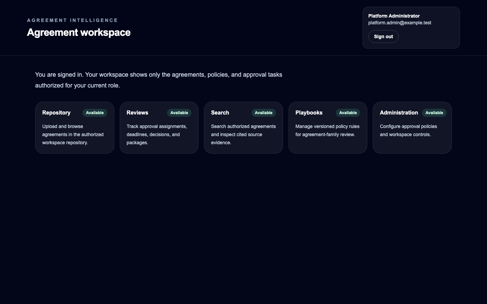
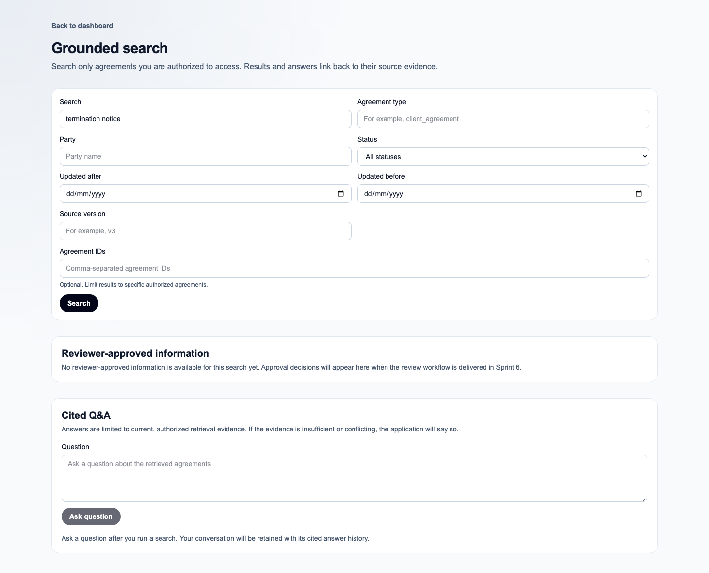
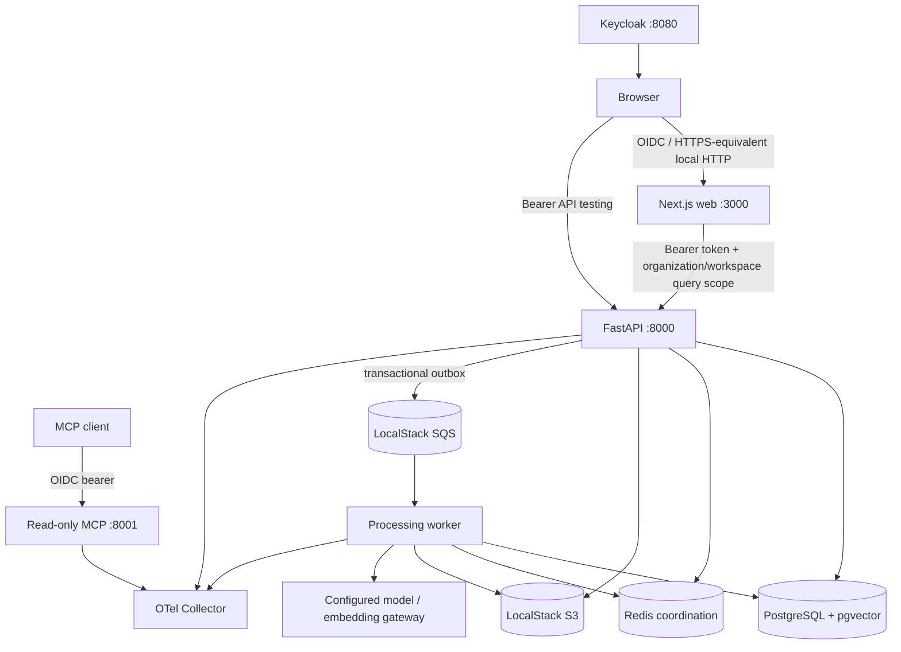

# Agreement Intelligence

Agreement Intelligence is a locally production-oriented legal document intelligence
platform for financial agreements. It turns PDF and DOCX agreements into structured,
cited, reviewable information and keeps legal review, approval, and audit decisions under
human control.

[Overview](#overview) | [Quick start](docs/getting-started.md) | [Architecture](docs/architecture/overview.md) | [Manual QA](docs/testing/manual-test-plan.md) | [API testing](docs/testing/api-testing.md) | [Operations](docs/operations/platform-foundation.md) | [Roadmap](docs/roadmap.md)

> [!IMPORTANT]
> This repository demonstrates a complete local product and a cloud-valid reference
> architecture. It is not legal advice, a hosted service, or evidence of a validated live
> AWS deployment. The repository owner retains the release-visibility and merge decisions.

## Contents

- [Overview](#overview)
- [Delivered capabilities](#delivered-capabilities)
- [Operating modes](#operating-modes)
- [Known boundaries](#known-boundaries)
- [Technology and repository map](#technology-and-repository-map)
- [Prerequisites](#prerequisites)
- [Quick start](#quick-start)
- [Configuration](#configuration)
- [Demo identities and permissions](#demo-identities-and-permissions)
- [First end-to-end walkthrough](#first-end-to-end-walkthrough)
- [As-built architecture](#as-built-architecture)
- [Services, ports, and persistence](#services-ports-and-persistence)
- [Development and verification](#development-and-verification)
- [Troubleshooting](#troubleshooting)
- [Security, privacy, and responsible AI](#security-privacy-and-responsible-ai)
- [LocalStack and the AWS path](#localstack-and-the-aws-path)
- [Documentation and contributing](#documentation-and-contributing)
- [License](#license)

## Overview

Financial agreements are difficult to review consistently: evidence is spread across
versions, preferred positions evolve, risk findings need citations, and approvals must be
separated and auditable. Agreement Intelligence provides a tenant-aware repository and an
end-to-end workflow for:

1. uploading and versioning a Client Agreement or Liquidity Provider Agreement;
2. processing it asynchronously into deterministic and optional provider-assisted output;
3. applying published legal playbooks and reviewing cited findings;
4. searching authorized evidence and asking grounded questions;
5. comparing immutable agreement versions;
6. routing legal and business approval stages; and
7. downloading checksum-backed final PDF/JSON packages.

The original document and qualified reviewer remain authoritative. The system exposes
provenance, citations, uncertainty, explicit unavailable states, and immutable human
workflow evidence instead of presenting model output as a decision.



[Back to contents](#contents)

## Delivered capabilities

- Tenant-scoped agreement repository with PDF/DOCX validation, checksum duplicate
  detection, archive/restore, asynchronous permanent deletion, and immutable versions.
- Isolated, resource-bounded parsing with an explicit `ocr_required` diagnostic for
  text-poor/image-only input.
- Deterministic classification, clause/evidence extraction, summaries, risk explanations,
  and provider-assisted enrichment when configured and validated.
- Versioned legal playbooks with draft editing, rule management, publication, archive,
  routing, and override evidence.
- PostgreSQL lexical retrieval, provider-backed embeddings/semantic retrieval, fusion,
  filters, cited results, grounded question threads, and explicit refusal states.
- Immutable agreement-version comparison with alignment, materiality, cited evidence, and
  unresolved states.
- Versioned approval policies, assignments, comments, reviewer decisions, legal/business
  stage separation, notifications, request changes, terminal audit history, and immutable
  final packages.
- Application authorization plus forced PostgreSQL row-level security, scoped S3 keys,
  read-only MCP tools, privacy-safe logs/telemetry, tenant quotas, and local recovery
  runbooks.
- Deterministic AI evaluation, local performance/resilience checks, LocalStack/Terraform
  verification, and executable browser/API/manual release evidence.



[Back to contents](#contents)

## Operating modes

Provider credentials are optional for startup but required for the complete provider-backed
experience. The system never silently treats degraded output as equivalent.

| Capability | Provider-powered | No key | Provider unavailable |
| --- | --- | --- | --- |
| Repository, versions, workflow, playbooks | Available | Available | Available |
| Deterministic parsing and rule analysis | Available | Available | Available for supported documents |
| Hosted/local compatible generation enrichment | Available after validation | Unavailable; deterministic artifacts remain | Explicit failure/unavailable state; deterministic artifacts remain |
| Embeddings and semantic retrieval | Available after indexing | Unavailable | New query embedding retries on a later query; missing document embeddings remain explicit |
| PostgreSQL lexical search | Available and fused with semantic candidates | Available | Available as the resilience fallback |
| Grounded provider answer | Available when evidence and citations validate | `model_unavailable`/actionable unavailable state | Actionable unavailable/failure state; no fabricated answer |
| Manual reprocessing/retry | Available | Available | Available after dependency recovery |
| Automatic historical AI backfill | Not implemented | Not implemented | Deferred; current recovery is manual |

Lexical retrieval matches normalized terms against authorized indexed text. It is useful
but not semantically equivalent to embeddings. Provider-generated answers require fresh
scoped retrieval and validated citations; insufficient or conflicting evidence returns an
explicit state.

The default hosted generation model in `.env.example` is `gpt-5.4-mini`, and the default
embedding model is `text-embedding-3-small` with 1,536 dimensions. Both are operator
configuration, not a product guarantee. An optional user-supplied `llama.cpp` endpoint can
be used through the `openai-compatible` gateway profile; no model weights are bundled or
downloaded.

[Back to contents](#contents)

## Known boundaries

- Only Client Agreements and Liquidity Provider Agreements are the initial measured
  product families; other financial/legal document families remain extensions.
- The system reports `ocr_required` but includes no OCR engine or OCR provider.
- Automatic provider-recovery reconciliation and historical enrichment backfill are not
  implemented; use authorized manual reprocessing after recovery.
- Model quality, legal interpretation, clause alignment, and materiality remain uncertain
  and require source review by a qualified human.
- Local Docker, LocalStack, and Terraform checks do not prove live AWS IAM, VPC, TLS, ALB,
  WAF, ECS, RDS, federation, scaling, cost, backup, or disaster-recovery behavior.
- The local stack is a demonstration topology. Internet exposure, production secrets,
  managed data retention, high availability, and organizational incident processes require
  an authorized deployment design.
- The owner must complete the [manual release pass](docs/testing/manual-test-plan.md) and
  decide when repository visibility changes.

See the [roadmap](docs/roadmap.md), [responsible-AI guide](docs/security/responsible-ai.md),
and revision-scoped [pre-publication review](docs/reviews/2026-08-22-pre-publication-review.md).

[Back to contents](#contents)

## Technology and repository map

| Area | Implementation |
| --- | --- |
| Web | Next.js 16, React 19, TypeScript, NextAuth/OIDC, Tailwind CSS |
| API | Python 3.13, FastAPI, SQLAlchemy, Alembic |
| Worker and AI | Python, SQS consumer, deterministic analysis, typed model/embedding gateway |
| Data | PostgreSQL 17 with pgvector, immutable/scoped object storage, Redis coordination |
| Identity | Keycloak OIDC locally; application-owned memberships, roles, permissions, forced RLS |
| Local infrastructure | Docker Compose, LocalStack S3/SQS, OpenTelemetry Collector |
| Cloud reference | Terraform mappings for AWS-compatible resources; live application deferred |
| Quality | Vitest, pytest, mypy, Ruff, ESLint, Playwright, evaluation and resilience gates |

```text
apps/web/             Next.js UI, server routes, browser tests
apps/api/             FastAPI domain/API, migrations, authorization
apps/worker/          Parsing, analysis, embeddings, queue processing
apps/mcp/             Remote read-only MCP tools
packages/platform-core/ Shared privacy and observability contracts
docker/               Local database, Keycloak, LocalStack, telemetry assets
infra/terraform/      LocalStack-compatible cloud reference module
docs/                 Architecture, security, QA, operations, evaluation, decisions
evals/                Frozen deterministic/provider-assisted evaluation inputs
scripts/              Stack, documentation, release, backup, and restore commands
tests/                CI, infrastructure, stack, operations, performance, resilience contracts
```

[Back to contents](#contents)

## Prerequisites

For the full local stack:

- Docker Engine/Desktop with Docker Compose **2.24 or newer**;
- GNU Make;
- at least 8 GB of memory available to Docker is recommended; and
- a current desktop browser. Automated browser coverage uses Playwright Chromium.

For source development and the public-release gate:

| Tool | Pinned/required version | Source of truth |
| --- | --- | --- |
| Node.js | `22.23.1` | `.node-version` |
| pnpm | `10.28.0` | `package.json` |
| Python | `3.13.14` | `.python-version` |
| uv | `0.11.32` in CI | `.github/workflows/ci.yml` |
| Terraform | `1.12.2` in CI | `.github/workflows/ci.yml` |
| terraform-local | `0.24.1` for infrastructure checks | `.github/workflows/ci.yml` |
| Checkov | `3.2.495` for policy checks | `.github/workflows/ci.yml` |

Use the pinned versions. `make check-toolchain` and `make check-container-toolchain`
explain mismatches without changing the machine.

[Back to contents](#contents)

## Quick start

From a fresh clone:

```bash
git clone https://github.com/ramioooz/agreement-intelligence.git
cd agreement-intelligence
cp .env.example .env
```

Open `.env` locally and replace **every** `change-me` placeholder with a unique,
URI-safe local value. Do not reuse production credentials and do not commit `.env`. Keep
`OPENAI_API_KEY=` empty for the deterministic/lexical rehearsal, or add a user-owned key
only after the no-key path passes.

Start and verify the full application:

```bash
make stack-up
make stack-check
```

Open <http://localhost:3000/sign-in>. Passwords are the values you placed in `.env` under
the demo identity variables; no default password is published.

Stop containers without deleting project data:

```bash
make stack-down
```

`make stack-down` preserves the PostgreSQL volume. The default LocalStack service is
ephemeral and its buckets/queues are recreated idempotently. The confirmed reset is
destructive and is intentionally separated under [Troubleshooting](#troubleshooting).

For a first-time walkthrough with environment-generation guidance and verification
checkpoints, use [Getting started](docs/getting-started.md).

[Back to contents](#contents)

## Configuration

`.env.example` is the complete local contract. Important groups are:

- PostgreSQL application/Keycloak databases and loopback port;
- Keycloak realm, confidential OIDC client, issuer, application origin/session secret;
- deterministic demo organization/workspace IDs and three demo identities;
- LocalStack S3/SQS resources and test-only AWS-compatible credentials;
- Redis, telemetry, and local retention-policy values;
- optional `OPENAI_API_KEY`, generation model, embedding model/dimensions/index version;
- model gateway, budgets, retry/cost metadata, and optional compatible endpoint; and
- web/API/MCP ports.

The stack validates required values, rejects placeholders, reserved database identifiers,
unsafe database-password characters, duplicate/out-of-range ports, origin/port mismatch,
and malformed URLs before starting.

Keep keys out of command history and process listings. Put provider configuration only in
the ignored `.env`, then run:

```bash
make provider-smoke
```

This is an explicit paid/external request. It prints only safe provider/model,
latency/usage, and validation metadata. It is excluded from CI.

### Optional local compatible model

Supply an existing GGUF file; the project does not download or commit weights:

```dotenv
LLAMA_CPP_MODEL_DIR=/absolute/path/to/models
LLAMA_CPP_GGUF_FILE=model.gguf
MODEL_GATEWAY_MODE=openai-compatible
MODEL_GATEWAY_MODEL=model.gguf
MODEL_GATEWAY_BASE_URL=http://llama-cpp:8080/v1
```

Start the optional profile with the same ignored environment:

```bash
docker compose --project-name agreement-intelligence --env-file .env \
  --profile local-model up --detach --build
```

The model directory is mounted read-only. Hosted fallback occurs only when the operator
also supplies a hosted key and explicitly configures `MODEL_GATEWAY_FALLBACK_MODE=openai`.

[Back to contents](#contents)

## Demo identities and permissions

Startup idempotently provisions the `Demo Legal` organization and `Client Agreement
Review` workspace plus these Keycloak/application identities:

| Username | Application role(s) | What the seeded identity can demonstrate | Password variable |
| --- | --- | --- | --- |
| `platform.admin` | `platform_admin` | All defined permissions, including playbook/policy administration, audit, assignment, and permanent deletion | `DEMO_ADMIN_PASSWORD` |
| `legal.reviewer` | `legal_reviewer` + `business_user` | Upload/update/read agreements, search, inspect evidence, and record reviewer decisions | `DEMO_REVIEWER_PASSWORD` |
| `business.approver` | `business_approver` | Read/search authorized agreements and act on eligible approval stages | `DEMO_BUSINESS_APPROVER_PASSWORD` |

No viewer or disabled account is seeded. Manual negative tests create/disable a temporary
synthetic Keycloak identity and remove it afterward. Unauthenticated users are redirected
to sign-in; API/MCP calls without a valid bearer token fail closed.

Role checks live in the API/database. Hidden navigation is usability, not authorization.

[Back to contents](#contents)

## First end-to-end walkthrough

Use only the synthetic fixtures listed in [Test data](docs/testing/test-data.md).

1. Sign in as `legal.reviewer`; open **Repository** and upload the synthetic PDF or DOCX.
2. Confirm immediate repository visibility, then wait for processing to reach a terminal
   state. Open the source viewer, deterministic analysis, citations, and provenance.
3. Sign in as `platform.admin`; create a Client Agreement playbook, add a policy rule,
   publish the immutable version, and confirm it routes to the synthetic agreement.
4. Return as `legal.reviewer`; inspect playbook findings, open cited evidence by keyboard,
   and record a reviewer decision with a non-sensitive rationale.
5. Open **Search**; filter the workspace, inspect lexical/semantic state, ask a grounded
   question, and follow every citation to the authorized source.
6. Upload a successor version, open **Compare**, start a comparison, and inspect alignment,
   materiality, uncertainty, and citations for baseline/target versions.
7. As `platform.admin`, create/publish a two-stage approval policy (legal reviewer then
   business approver), create/assign the review, and verify role separation.
8. Complete the legal stage as `legal.reviewer`, then the business stage as
   `business.approver`. Confirm self/unauthorized approval is denied.
9. Open the audit timeline and download the terminal PDF plus JSON manifest. Verify the
   displayed checksums and reload persistence.

Provider mode adds validated enrichment, embeddings, semantic retrieval, and generated
answers. No-key mode still demonstrates repository, deterministic analysis, playbooks,
lexical search, versions, review, approval, audit, and explicit provider-unavailable state.

The [manual QA plan](docs/testing/manual-test-plan.md) provides exact identities,
preconditions, evidence, cleanup, negative paths, and stable `MQA-*` IDs.

[Back to contents](#contents)

## As-built architecture



The API authorizes and persists intent; S3 owns source/artifact bytes; PostgreSQL owns
business state, versions, vectors, outbox, audit, and tenant enforcement; SQS wakes the
idempotent worker; Redis coordinates limits/budgets/locks/cache but is not a job queue.

See [Architecture](docs/architecture/overview.md) for authentication, upload/queue/worker,
hybrid retrieval/Q&A, comparison, approval, MCP, telemetry-redaction, local/cloud-reference,
and deferred-cloud diagrams.

[Back to contents](#contents)

## Services, ports, and persistence

All default published services bind to `127.0.0.1`.

| Service | Default local endpoint | Health/role |
| --- | --- | --- |
| Web | <http://localhost:3000> | Home, sign-in, protected dashboard |
| API | <http://localhost:8000> | `/health/live`, `/health/ready`, `/docs`, `/openapi.json` |
| MCP | <http://localhost:8001/mcp> | OIDC-protected read-only tools |
| Keycloak | <http://localhost:8080> | Local OIDC realm and sign-in |
| PostgreSQL | `127.0.0.1:5432` | Application/Keycloak databases, pgvector; named volume |
| Redis | `127.0.0.1:6379` | Ephemeral coordination |
| LocalStack | <http://localhost:4566> | Ephemeral local S3/SQS-compatible gateway |
| OTel Collector | `127.0.0.1:4317`, `127.0.0.1:4318` | OTLP gRPC/HTTP receivers |
| Optional Langfuse | <http://localhost:3001> | Explicit observability profile only |
| Optional llama.cpp | <http://localhost:8081> | Explicit local-model profile only |

`localstack-bootstrap` and `keycloak-bootstrap` are one-shot idempotent jobs, not persistent
application services. `make stack-check` verifies nine running application services,
successful bootstrap jobs, pgvector, LocalStack resources, realm/client/users, API docs,
web-to-API connectivity, and worker startup.

[Back to contents](#contents)

## Development and verification

Install locked source dependencies:

```bash
make setup
```

| Command | Purpose |
| --- | --- |
| `make format-check` | Check Prettier and Ruff formatting |
| `make lint` | Run ESLint and Ruff |
| `make typecheck` | Run TypeScript and strict mypy |
| `make test` | Run web/Python plus CI/auth contracts |
| `make build` | Build web and all Python packages |
| `make check` | Run the complete source gate |
| `make ai-eval` | Run deterministic unified AI evaluation |
| `make terraform-check` | Run Terraform format/init/validate, policy, and LocalStack plan contracts |
| `make terraform-provision-local` | Apply/inspect/destroy the verified module in LocalStack |
| `make release-check` | Run the non-destructive public-release gate; required env is documented in release evidence |

`make check` requires `AGREEMENT_INTELLIGENCE_TEST_POSTGRES_URL` pointing to a disposable
PostgreSQL database because forced-RLS verification may not be skipped. CI supplies the
database plus Redis and LocalStack services.

Documentation-only checks:

```bash
node scripts/check-doc-links.mjs
tests/docs/test-documentation-contract.sh
pnpm exec prettier --check README.md SECURITY.md CODE_OF_CONDUCT.md CONTRIBUTING.md docs
git diff --check
```

API and browser execution are covered by [API testing](docs/testing/api-testing.md) and
[Manual QA](docs/testing/manual-test-plan.md). Performance, resilience, backups, provider
smoke, and assisted evaluation are opt-in because they require live containers, disposable
state, or an external provider.

[Back to contents](#contents)

## Troubleshooting

Start with non-destructive inspection:

```bash
make stack-status
docker compose --project-name agreement-intelligence --env-file .env ps --all
docker compose --project-name agreement-intelligence --env-file .env logs --tail 200 <service>
make stack-check
```

| Symptom | Safe diagnosis and recovery |
| --- | --- |
| Missing `.env` / placeholder rejection | Copy `.env.example`; replace every `change-me`; rerun `scripts/validate-stack-env.sh .env` |
| Port conflict | Change the relevant `*_PORT`; if `WEB_PORT` changes, update `WEB_PUBLIC_ORIGIN` and `AUTH_URL` to the same origin |
| Keycloak/bootstrap unhealthy | Inspect `keycloak` and `keycloak-bootstrap`; verify realm/client/users with `make stack-check`; clear stale browser cookies only after preserving safe evidence |
| Sign-in loops/stale logout | Sign out through the app, close local tabs, clear only localhost site data, then retry; confirm issuer/origin values match |
| Provider key missing/invalid | No-key startup is valid; use explicit degraded behavior. For provider mode, verify ignored `.env`, account/model/quota, then `make provider-smoke` without printing the key |
| Search lacks semantic results | Check embedding state/model/dimensions; lexical search remains available. Reprocess manually after provider recovery |
| Processing queued/stuck/failed | Inspect worker/API/LocalStack safe logs and queue depth; use the [stuck-processing](docs/operations/runbooks/stuck-processing.md) or [queue-backlog](docs/operations/runbooks/queue-backlog.md) runbook |
| `ocr_required` | Supply a text-bearing PDF/DOCX or integrate an approved OCR service; none is included |
| Terraform tool missing | Install pinned Terraform, terraform-local, and Checkov versions; the check fails rather than silently skipping |
| RLS test refuses to run | Supply an explicit disposable PostgreSQL URL; never point it at retained/production data |
| Data recovery needed | Follow [backup and restore](docs/operations/backup-restore.md); do not improvise against the only copy |

### Destructive reset

`make stack-reset CONFIRM=reset` deletes the Compose project's local volumes and recreates
the stack. Confirm the project name, take a backup if needed, and never use this as ordinary
startup troubleshooting:

```bash
make stack-status
make backup-local BACKUP_DIR=artifacts/backups/<timestamp>
make stack-reset CONFIRM=reset
```

[Back to contents](#contents)

## Security, privacy, and responsible AI

- OIDC authenticates; application memberships/permissions and forced PostgreSQL RLS
  authorize. UI visibility is not a security boundary.
- Documents and provider output are untrusted. Parsing is resource-bounded; prompt
  injection is treated as evidence text; typed output, citations, accessible anchors, and
  deterministic authority are validated.
- Object keys, vectors, versions, audit, workflow, packages, deletion records, and backups
  retain tenant scope.
- Logs and traces use safe operational fields. Raw document text, prompts, provider output,
  emails, tokens, cookies, keys, and request bodies are excluded before export.
- MCP exposes only `search_agreements`, `get_citation`, `get_agreement_status`, and
  `get_review_status`, all through the same fail-closed tenant/permission boundary.
- Provider use is operator opt-in. Verify provider privacy/retention terms and never send a
  document without authorization.
- No model output is legal advice or an autonomous decision. A human must inspect the
  original source and record review/approval rationale.

Read [Security policy](SECURITY.md), [Threat model](docs/security/threat-model.md),
[Responsible AI](docs/security/responsible-ai.md), and
[Secure uploads](docs/secure-document-upload.md).

[Back to contents](#contents)

## LocalStack and the AWS path

The local system maps object storage/queues and Terraform resources to AWS-compatible
interfaces. LocalStack proves repeatable local wiring, redrive policies, encryption/lifecycle
configuration shape, and provider/resource contracts. The
[Terraform runbook](infra/terraform/README.md) documents the migration boundary.

An owner-authorized cloud phase must still replace test endpoints/credentials, configure
real IAM/network/TLS/secrets, deploy applications, migrate data, and verify ECS/RDS/ALB/WAF,
federation, observability, scaling, cost, backups, and disaster recovery in real AWS.
Nothing in this repository claims that phase has run.

[Back to contents](#contents)

## Documentation and contributing

Start with the [documentation index](docs/README.md). It routes newcomers to getting
started, architecture, QA, API/Insomnia, operations, security, evaluation, decisions,
limitations, and roadmap material.

Contributions are issue-first, isolated-branch, pull-request-only, synthetic-data-only, and
owner-merged. See [Contributing](CONTRIBUTING.md) and the
[Code of Conduct](CODE_OF_CONDUCT.md). Security reports follow [Security policy](SECURITY.md),
not public issues.

[Back to contents](#contents)

## License

Licensed under the [Apache License 2.0](LICENSE).

[Back to top](#agreement-intelligence)
