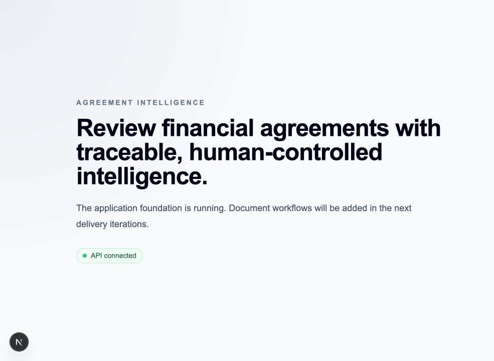

# Agreement Intelligence

Agreement Intelligence is a production-oriented legal document intelligence
platform for financial agreements. It turns uploaded agreements into
structured, cited, reviewable information and supports human-controlled legal
review and approval.

The first product release focuses on Client Agreements and Liquidity Provider
Agreements. Later releases can extend the same architecture to Prime Broker
Agreements, IB Agreements, ISDA documentation, and regulatory documents.

## Planned capabilities

- Secure, tenant-isolated agreement repository
- PDF and DOCX parsing with OCR fallback
- Agreement classification and clause extraction
- Evidence-backed summaries and risk findings
- Versioned legal playbooks and preferred clause positions
- Hybrid search and natural-language questions with citations
- Agreement-version comparison
- Human review, approval, and immutable audit history
- Measured AI quality, security controls, and operational telemetry

## Local development

### Prerequisites

- Node.js 22.23.1
- pnpm 10.28.0
- Python 3.13.14, installed automatically by uv
- uv
- GNU Make

From the repository root, install the locked dependencies and start all
applications:

```bash
make setup
make dev
```

The local applications are available at:

- Web application: <http://localhost:3000>
- API liveness: <http://localhost:8000/health/live>
- API documentation: <http://localhost:8000/docs>



The worker starts as a long-running Python process and logs its lifecycle. It
does not consume messages until the queue infrastructure is delivered. Press
Control-C in the terminal running `make dev` to stop all three applications.

| Command | Purpose |
| --- | --- |
| `make help` | List supported commands. |
| `make check-toolchain` | Verify the pinned Node.js and pnpm versions and uv availability. |
| `make setup` | Verify tools and install locked dependencies. |
| `make dev` | Start web, API, and worker. |
| `make dev-web` | Start only the web application. |
| `make dev-api` | Start only the API. |
| `make dev-worker` | Start only the worker. |
| `make format` | Format TypeScript and Python. |
| `make format-check` | Check TypeScript and Python formatting without changing files. |
| `make lint` | Lint TypeScript and Python. |
| `make typecheck` | Type-check TypeScript and Python. |
| `make test` | Run JavaScript and Python tests. |
| `make build` | Build every application. |
| `make check` | Run all pre-review checks. |

See the
[monorepo foundation design](docs/plans/2026-07-27-monorepo-foundation-design.md)
for the accepted scope and boundaries.

## Architecture

Start with the [architecture overview](docs/architecture/overview.md). The
initial decisions are recorded separately:

1. [Use a modular monorepo](docs/adr/0001-use-a-modular-monorepo.md)
2. [Use Next.js and FastAPI](docs/adr/0002-use-nextjs-and-fastapi.md)
3. [Use OIDC authentication](docs/adr/0003-use-oidc-authentication.md)
4. [Use hybrid authorization](docs/adr/0004-use-hybrid-authorization.md)
5. [Use durable asynchronous processing](docs/adr/0005-use-durable-asynchronous-processing.md)

## Delivery

Development proceeds in business-visible increments. Every change is made on a
dedicated branch, linked to an issue, and delivered through a pull request.
Only the repository owner merges changes into `main`.

See [CONTRIBUTING.md](CONTRIBUTING.md) for the complete delivery and review
policy.
