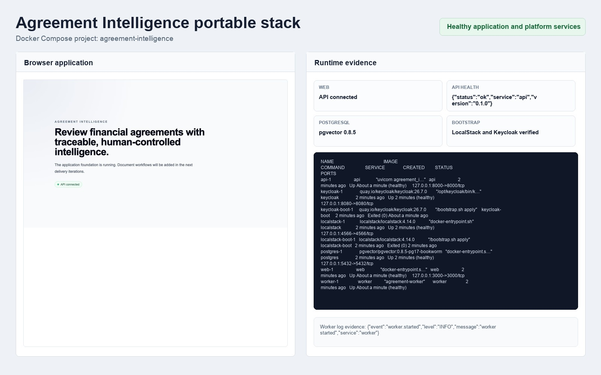

# Agreement Intelligence

Agreement Intelligence is a production-oriented legal document intelligence
platform for financial agreements. It turns uploaded agreements into
structured, cited, reviewable information and supports human-controlled legal
review and approval.

The first product release focuses on Client Agreements and Liquidity Provider
Agreements. Later releases can extend the same architecture to Prime Broker
Agreements, IB Agreements, ISDA documentation, and regulatory documents.

## Planned capabilities

- Secure, tenant-isolated agreement repository
- PDF and DOCX parsing with OCR fallback
- Agreement classification and clause extraction
- Evidence-backed summaries and risk findings
- Versioned legal playbooks and preferred clause positions
- Hybrid search and natural-language questions with citations
- Agreement-version comparison
- Human review, approval, and immutable audit history
- Measured AI quality, security controls, and operational telemetry

## Run the complete application

### Prerequisites

- Docker Engine with Docker Compose 2.24 or newer
- GNU Make

Copy the safe environment template and replace every `change-me` value:

```bash
cp .env.example .env
```

Build and start the complete application:

```bash
make stack-up
make stack-check
```

Docker groups every container, network, and volume under the
`agreement-intelligence` Compose project.



The stack contains the web application, API, worker, PostgreSQL with pgvector,
LocalStack for S3 and SQS, Keycloak, and the protected web dashboard shell.
Document-processing workflows are delivered in later iterations.

The local applications are available at:

- Web application: <http://localhost:3000>
- Sign-in page: <http://localhost:3000/sign-in>
- Protected dashboard: <http://localhost:3000/dashboard>
- API liveness: <http://localhost:8000/health/live>
- API documentation: <http://localhost:8000/docs>
- Keycloak: <http://localhost:8080>
- LocalStack gateway: <http://localhost:4566>

The development realm includes these seeded demo users after startup:

| User | Username | Purpose |
| --- | --- | --- |
| Legal Reviewer | `legal.reviewer` | Business user for agreement review workflows. |
| Platform Administrator | `platform.admin` | Administrative user for platform setup workflows. |

Passwords come from `.env` and must not be committed.

Use the sign-in page to authenticate with Keycloak. The application stores its
local session in HTTP-only cookies and redirects unauthenticated dashboard
requests back to sign-in.
If you change `WEB_PORT`, also update `WEB_PUBLIC_ORIGIN` so Keycloak and the
web app agree on callback URLs.

| Command | Purpose |
| --- | --- |
| `make help` | List supported commands. |
| `make stack-build` | Build application container images. |
| `make stack-up` | Build, start, and wait for the complete stack. |
| `make stack-down` | Stop containers while preserving project data. |
| `make stack-status` | Show project containers and health state. |
| `make stack-logs` | Follow logs for the complete stack. |
| `make stack-check` | Verify services and bootstrapped resources. |
| `make stack-reset CONFIRM=reset` | Delete project volumes and recreate the stack. |

`make stack-down` removes containers and the network, but preserves the
PostgreSQL named volume. LocalStack is intentionally ephemeral; its S3 bucket
and SQS queues are recreated idempotently on startup.

`make stack-reset CONFIRM=reset` permanently deletes local project volumes and
recreates the stack. The command refuses to run without the explicit
confirmation value.

### Troubleshooting

If startup fails after changing database users or passwords, run the confirmed
reset command to recreate local volumes:

```bash
make stack-reset CONFIRM=reset
```

If a service is unhealthy, inspect status and logs:

```bash
make stack-status
make stack-logs
```

Run `make stack-check` after fixes. It verifies container health, pgvector,
LocalStack resources, Keycloak configuration, API liveness and documentation,
web-to-API connectivity, and worker startup.

### Source-quality commands

Contributors changing source code also use the pinned Node.js, pnpm, Python,
and uv toolchains:

```bash
make setup
```

| Command | Purpose |
| --- | --- |
| `make setup` | Install locked source dependencies. |
| `make format` | Format TypeScript and Python. |
| `make format-check` | Check formatting without changing files. |
| `make lint` | Lint TypeScript and Python. |
| `make typecheck` | Type-check TypeScript and Python. |
| `make test` | Run JavaScript and Python tests. |
| `make build` | Build every application outside Docker. |
| `make check` | Run all pre-review source checks. |

See the
[monorepo foundation design](docs/plans/2026-07-27-monorepo-foundation-design.md)
for the accepted scope and boundaries.

## Architecture

Start with the [architecture overview](docs/architecture/overview.md). The
initial decisions are recorded separately:

1. [Use a modular monorepo](docs/adr/0001-use-a-modular-monorepo.md)
2. [Use Next.js and FastAPI](docs/adr/0002-use-nextjs-and-fastapi.md)
3. [Use OIDC authentication](docs/adr/0003-use-oidc-authentication.md)
4. [Use hybrid authorization](docs/adr/0004-use-hybrid-authorization.md)
5. [Use durable asynchronous processing](docs/adr/0005-use-durable-asynchronous-processing.md)

## Delivery

Development proceeds in business-visible increments. Every change is made on a
dedicated branch, linked to an issue, and delivered through a pull request.
Only the repository owner merges changes into `main`.

See [CONTRIBUTING.md](CONTRIBUTING.md) for the complete delivery and review
policy.
