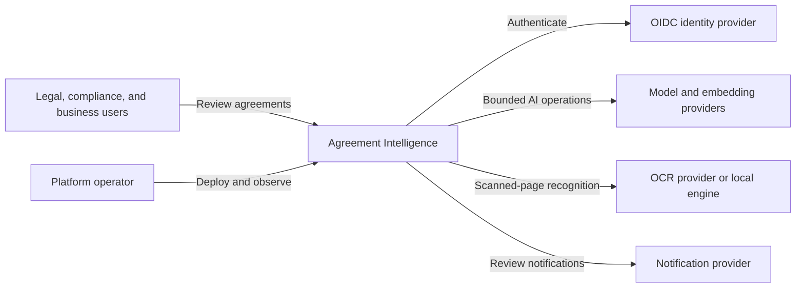
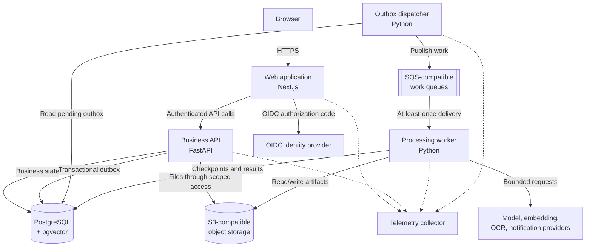
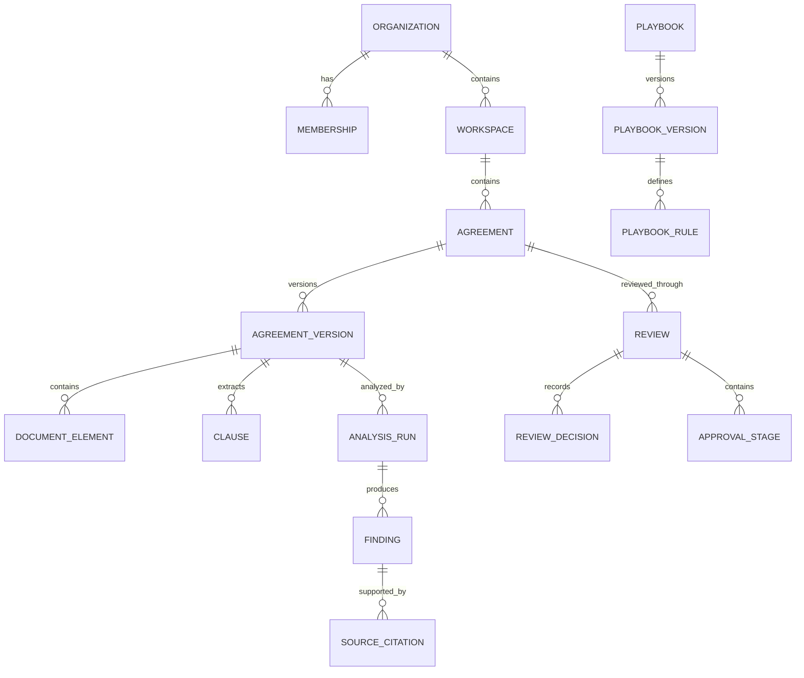

# Agreement Intelligence Architecture

## 1. Purpose

Agreement Intelligence is a multi-tenant legal document intelligence platform
for financial agreements. It helps legal, compliance, and business users:

- store and organize agreements securely;
- extract clauses and normalized agreement facts;
- identify missing, unusual, and non-compliant language;
- review findings against versioned legal playbooks;
- search and question permitted agreements using natural language;
- compare agreement versions and prioritize material changes; and
- route agreements through human-controlled review and approval.

The platform assists professional review. It does not provide legal advice,
make autonomous approval decisions, or replace accountable reviewers.

## 2. Initial scope

### 2.1 Agreement families

The first release supports:

1. Client Agreements
2. Liquidity Provider Agreements

Additional agreement families are introduced only after representative,
human-labelled evaluation data demonstrates acceptable extraction and citation
quality.

### 2.2 In-scope capabilities

- Branded sign-in backed by an external identity provider
- Organization, workspace, membership, and role management
- Secure PDF and DOCX upload
- OCR fallback for scanned PDFs
- Canonical document structure and stable source citations
- Agreement classification, clause extraction, and cited summaries
- Versioned playbooks and clause-level risk review
- Hybrid lexical and semantic search
- Grounded questions and answers with insufficient-evidence handling
- Agreement-version alignment and comparison
- Assignments, comments, approval stages, and audit history
- AI evaluation, observability, rate limits, and cost controls
- Reproducible local operation and a documented AWS deployment path

### 2.3 Explicitly deferred

- Electronic signatures
- Automated negotiation with counterparties
- Autonomous legal approval
- Billing and subscription management
- Customer relationship management integrations
- Office-suite add-ins
- Mobile applications
- A general-purpose event-streaming platform
- Training or fine-tuning foundation models

These exclusions keep the first release focused on reliable document
intelligence and review.

## 3. Actors and responsibilities

| Actor | Responsibilities |
| --- | --- |
| Platform administrator | Operates platform configuration and deployment without bypassing audit controls |
| Organization administrator | Manages organization members, roles, workspaces, and organization settings |
| Legal administrator | Manages playbooks, clause positions, and approval policies |
| Legal reviewer | Reviews evidence, corrects findings, comments, and makes assigned decisions |
| Business user | Uploads agreements, starts reviews, searches permitted content, and monitors status |
| Auditor | Reads approved records, source evidence, decisions, and audit history |
| External identity provider | Authenticates users and applies identity security controls |
| Model provider | Performs bounded classification, extraction, generation, or embedding operations |

No role receives access to another tenant. Resource-level access further limits
users to permitted workspaces, agreements, and reviews.

## 4. Architectural principles

1. **Evidence before assertion.** Material AI claims must link to source
   locations that a reviewer can inspect.
2. **Human accountability.** AI results are proposals until an authorized
   person reviews them.
3. **Tenant isolation by default.** Authorization is enforced in the API and
   reinforced in the database.
4. **Immutable sources and history.** Original files, published playbooks,
   agreement versions, AI result versions, and audit events are not overwritten.
5. **Asynchronous expensive work.** HTTP requests do not wait for OCR, model
   inference, indexing, comparison, or exports.
6. **Provider-neutral boundaries.** Model, embedding, OCR, identity, storage,
   and queue integrations sit behind application-owned interfaces.
7. **Measured quality.** Prompt or model changes are evaluated against frozen,
   human-labelled datasets before release.
8. **Least privilege.** Users and workloads receive only the permissions needed
   for their current operation.
9. **Local/cloud parity.** Local services implement the same protocols used in
   the AWS reference deployment.
10. **Simple until justified.** The initial system is a modular monolith with
    separately deployable processes, not a collection of microservices.

## 5. System context



External systems are untrusted dependencies. Their responses are validated,
timed out, rate-limited, and never used to grant authorization.

## 6. Container architecture



### 6.1 Web application

The web application owns:

- user interface and routing;
- the branded authentication entry point;
- secure server-side session handling;
- presentation-specific composition; and
- accessible loading, failure, empty, and permission-denied states.

It does not own agreement rules, authorization decisions, workflow state, or
model-provider integration.

### 6.2 Business API

The API is the authoritative application boundary. It owns:

- tenant and resource authorization;
- agreement, playbook, review, search, and administration APIs;
- transaction boundaries and idempotency records;
- optimistic concurrency checks;
- audit and outbox writes; and
- validation of all external input.

The API publishes an OpenAPI contract used to generate the web client.

### 6.3 Processing worker

The worker owns long-running and retryable operations:

- parsing and OCR;
- canonical document construction;
- classification and clause extraction;
- summary and risk generation;
- embedding and indexing;
- version comparison;
- report export; and
- notification delivery.

Every job is idempotent, checkpointed, observable, and safe under at-least-once
message delivery.

### 6.4 Outbox dispatcher

The dispatcher bridges committed database transactions to work queues. It reads
undelivered outbox records, publishes versioned message envelopes, and records
delivery attempts. Duplicate publication is expected; consumers remain
idempotent.

### 6.5 PostgreSQL

PostgreSQL is the system of record for:

- tenants, memberships, roles, and permissions;
- agreements, versions, parties, and processing state;
- canonical document metadata and source anchors;
- clauses, findings, playbooks, reviews, and approvals;
- vector embeddings and lexical search indexes;
- idempotency, outbox, and workflow checkpoints; and
- immutable audit events.

Row-level security reinforces tenant boundaries. Application authorization
remains mandatory even when row-level security is enabled.

### 6.6 Object storage

Object storage contains:

- immutable original files;
- derived page images and safe viewer representations;
- large extraction artifacts; and
- generated reports.

Database records contain object references and checksums, not public URLs.
Access is short-lived, scoped, authorized, logged, and encrypted in production.

### 6.7 Work queues

SQS-compatible queues provide durable delivery, backpressure, retries,
visibility timeouts, dead-letter handling, and independent worker scaling.
Local development uses a protocol-compatible emulator; AWS uses managed queues.

The first release starts with three queue families:

- agreement processing;
- exports; and
- notifications.

Large or sensitive payloads remain in the database or object storage. Messages
carry identifiers, schema version, tenant, correlation, and causation metadata.

## 7. Monorepo boundaries

The planned repository structure is:

```text
agreement-intelligence/
├── apps/
│   ├── web/
│   ├── api/
│   └── worker/
├── packages/
│   ├── ai-core/
│   ├── agreement-analysis/
│   ├── document-processing/
│   ├── retrieval/
│   └── shared/
├── evals/
├── infra/
├── docs/
├── sample-data/
├── scripts/
└── tests/
```

Packages contain domain or integration logic independent of HTTP and UI
concerns. Applications compose packages at deployment boundaries. Imports must
not create a dependency from a domain package back into an application.

## 8. Core domain model



Important invariants:

- an agreement belongs to exactly one tenant and workspace;
- an agreement version and original source are immutable;
- a published playbook version is immutable;
- an analysis run records the document, model, prompt, schema, and playbook
  versions that produced it;
- a finding separates model output from reviewer decisions;
- material findings require valid source citations;
- approval decisions are append-only; and
- every sensitive state transition produces an audit event.

## 9. Agreement-processing flow

```mermaid
sequenceDiagram
    participant U as User
    participant W as Web
    participant A as API
    participant D as PostgreSQL
    participant O as Object storage
    participant Q as Queue
    participant P as Worker

    U->>W: Upload agreement
    W->>A: Request scoped upload
    A->>D: Authorize and create pending version
    A-->>W: Short-lived upload instruction
    W->>O: Upload original file
    W->>A: Finalize upload with idempotency key
    A->>D: Verify checksum; create job and outbox atomically
    A-->>W: 202 Accepted with job URL
    D-->>Q: Dispatcher publishes job
    Q->>P: Deliver job
    P->>D: Claim job idempotently
    P->>O: Read source
    P->>D: Store checkpoints and structured results
    P->>Q: Acknowledge after successful persistence
    W->>A: Read processing status
    A-->>W: Current stage and safe failure details
```

Processing stages are explicit:

```text
RECEIVED
PARSING
OCR
CLASSIFYING
EXTRACTING
SUMMARIZING
EMBEDDING
PLAYBOOK_REVIEW
INDEXING
COMPLETED
FAILED
```

Failures retain their last successful checkpoint. Transient failures use
bounded retries with exponential backoff and jitter. Permanent failures stop
automatically and present a safe, actionable state to an authorized user.

## 10. Synchronous and asynchronous boundaries

| Operation | Boundary | Rationale |
| --- | --- | --- |
| Sign in, authorize, browse repository | Synchronous | User requires an immediate result |
| Create upload instruction | Synchronous | Short validation and authorization transaction |
| Parse, OCR, analyze, embed, compare | Asynchronous | Expensive and dependent on external services |
| Search retrieval | Synchronous | Interactive, bounded query |
| Generate grounded answer | Asynchronous request with interactive status or stream | Potentially slow provider operation |
| Reviewer decision | Synchronous command | Must validate current version and authorization |
| Approval workflow continuation | Asynchronous | May pause for people and survive restarts |
| Generate report | Asynchronous | Potentially expensive artifact creation |
| Send notification | Asynchronous | External side effect must not hold business transactions open |

## 11. Authentication

Authentication uses the OIDC authorization-code flow with PKCE:

1. the web application redirects the user to the configured identity provider;
2. the provider authenticates the user and applies MFA or conditional access;
3. the server completes the code exchange;
4. provider tokens remain outside browser JavaScript; and
5. the browser receives a secure, HTTP-only application session cookie.

The platform does not implement password storage. Local development uses a
containerized identity provider with seeded accounts. The AWS reference
deployment uses a managed identity service and supports enterprise federation.

Identity establishes who the user is. It does not decide which agreements the
user may access.

## 12. Authorization

Authorization combines:

- role-based permissions;
- mandatory tenant equality;
- workspace and resource membership;
- confidentiality attributes;
- assignment and ownership; and
- current workflow state.

Example evaluation:

```text
Allow reviews:approve only when:
1. the session is valid;
2. the review belongs to the active tenant;
3. the user holds reviews:approve;
4. the user can access the review workspace;
5. the user is eligible for the current approval stage; and
6. the submitted review version matches the current version.
```

The API enforces policy for every operation. The UI may hide unavailable
actions for usability, but UI state is never an authorization control.
Optimistic locking prevents silent concurrent overwrites.

## 13. Evidence and AI-result lifecycle

All model-facing features use application-owned, versioned schemas. Results
record:

- model route and model version;
- prompt version;
- structured-output schema version;
- source document and extraction version;
- playbook version, if applicable;
- retrieved context, where applicable;
- token usage, latency, and cost metadata; and
- source citations.

Source citations refer to stable canonical document elements and page anchors.
A deterministic validator confirms that cited anchors exist in the authorized
context. Missing or contradictory evidence results in an explicit
insufficient-evidence state.

AI results are immutable. A reviewer decision is a separate, attributable
record and never rewrites historical output.

## 14. Reliability and consistency

### 14.1 Idempotency

Idempotency is required for retried commands such as upload finalization,
agreement-version creation, processing requests, exports, and approval
decisions. A reused key with a different request fingerprint returns a
conflict. Database uniqueness constraints provide the final duplicate barrier.

### 14.2 Optimistic concurrency

Mutable records carry a version. Updates include the expected version and fail
with a conflict if another actor changed the record. Immutable records and
append-only events are never updated through optimistic locking.

### 14.3 External dependencies

Every network client defines:

- a strict timeout;
- retryable and permanent error classes;
- a bounded retry budget;
- exponential backoff with jitter;
- concurrency limits;
- circuit-breaker behaviour where repeated calls could amplify an outage; and
- telemetry that excludes sensitive content.

Fallback between models is allowed only when the operation explicitly permits
it and evaluation demonstrates equivalent behaviour.

### 14.4 Messaging

Queues provide at-least-once delivery, so consumers must be idempotent. Messages
are acknowledged only after results are durably persisted. Exhausted messages
move to a dead-letter queue for inspected, authorized redrive.

Business transactions write an outbox record in the same transaction as the
state change. This prevents committed business state from being separated from
the work request that follows it.

## 15. Security and privacy boundaries

Security controls include:

- tenant-scoped database access and row-level security;
- encrypted transport and production storage;
- short-lived object access;
- secrets stored outside source control;
- restricted service identities;
- file type, signature, size, checksum, and malware validation;
- rate limits, quotas, and cost budgets;
- prompt-injection isolation and adversarial evaluation;
- no agreement content, credentials, prompts, or provider responses in normal
  application logs;
- immutable audit events for sensitive actions; and
- configurable retention and deletion policies.

Agreement text is untrusted input. It cannot redefine system policy, change
authorization, select unrestricted tools, or trigger external actions without
application validation and required human approval.

## 16. Observability

The web, API, dispatcher, and worker emit correlated traces, structured logs,
and metrics. The initial telemetry contract includes:

- request and job latency;
- error and retry counts;
- queue depth, age, and dead-letter count;
- processing stage duration;
- provider calls, tokens, and estimated cost;
- retrieval and citation metrics;
- workflow status and paused duration;
- rate-limit and guardrail decisions; and
- evaluation results by version.

Correlation identifiers propagate across HTTP, outbox events, queues, and
worker checkpoints. Tenant identifiers may be logged only in an approved,
non-derivable form.

## 17. Deployment model

### 17.1 Local development

Docker Compose provides:

- PostgreSQL with pgvector;
- S3-compatible object storage;
- an SQS-compatible queue emulator;
- a containerized OIDC identity provider; and
- local telemetry collection and dashboards.

Web, API, and worker processes may run directly for fast development while
using the containerized dependencies.

### 17.2 AWS reference deployment

The reference environment uses:

- CloudFront and a web application deployment;
- an application load balancer;
- ECS Fargate services for the API, worker, and dispatcher;
- RDS PostgreSQL with pgvector;
- S3;
- SQS with dead-letter queues;
- managed identity with enterprise federation;
- Secrets Manager and KMS;
- CloudWatch and OpenTelemetry-compatible export; and
- WAF.

Terraform defines environments, least-privilege workload identities,
encryption, backup, monitoring, and cost-conscious defaults. Infrastructure
plans are reviewed through pull requests. Applying infrastructure remains an
explicit owner-controlled action.

## 18. Testing and evaluation strategy

| Layer | Verification |
| --- | --- |
| Domain packages | Unit and property tests for deterministic rules and invariants |
| Database | Migration, constraint, row-level security, and concurrency tests |
| API | Contract, authorization, idempotency, and error-response tests |
| Worker | Duplicate delivery, retry, checkpoint, timeout, and failure-injection tests |
| Web | Component accessibility and end-to-end business workflows |
| Integrations | Contract tests against local protocol-compatible services |
| AI quality | Frozen datasets for classification, extraction, retrieval, grounding, comparison, and citations |
| Security | Cross-tenant access, prompt injection, secret leakage, file abuse, and rate-limit tests |
| Operations | Load, restore, redrive, provider outage, and worker restart exercises |

Prompt, model, schema, or retrieval changes must show evaluation deltas against
the accepted baseline. A test run cannot silently replace its own baseline.

## 19. Initial non-functional objectives

These are design objectives to validate and refine with measured workloads:

| Objective | Initial target |
| --- | --- |
| Tenant isolation | Zero permitted cross-tenant reads or writes in automated tests |
| Citation integrity | Every material generated claim has a valid authorized source anchor |
| Synchronous API latency | p95 below 750 ms, excluding file transfer and model operations |
| Repository search latency | p95 below 2 seconds for the representative dataset |
| Upload finalization | Acknowledge within 2 seconds and process asynchronously |
| Job recovery | Resume safely after duplicate delivery or worker restart |
| Auditability | Reconstruct all sensitive state transitions from append-only events |
| Backup recovery | Documented target RPO of 24 hours and RTO of 4 hours for the reference environment |

Quality thresholds for classification, extraction, retrieval, and citations
are set only after the first representative evaluation dataset is labelled.

## 20. Decision ownership and evolution

Architecture changes require an ADR when they alter:

- system or deployment boundaries;
- a source-of-truth decision;
- authentication or authorization;
- persistence or messaging guarantees;
- externally visible API compatibility;
- security or privacy posture; or
- a major framework or managed-service dependency.

ADRs are append-only. Superseded decisions remain in the repository and link to
their replacement. Granular implementation choices that do not cross these
boundaries do not require an ADR.
