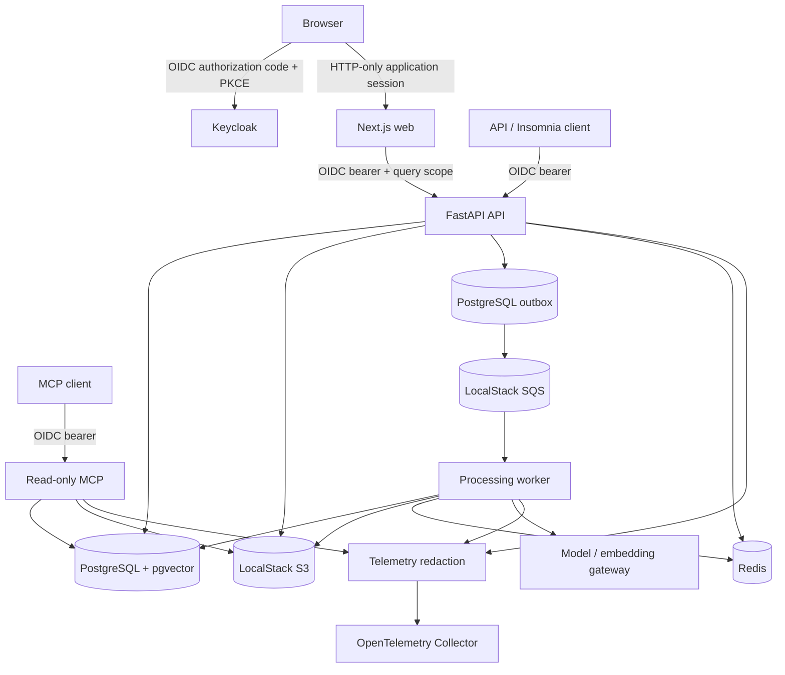
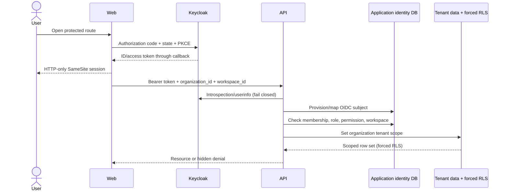
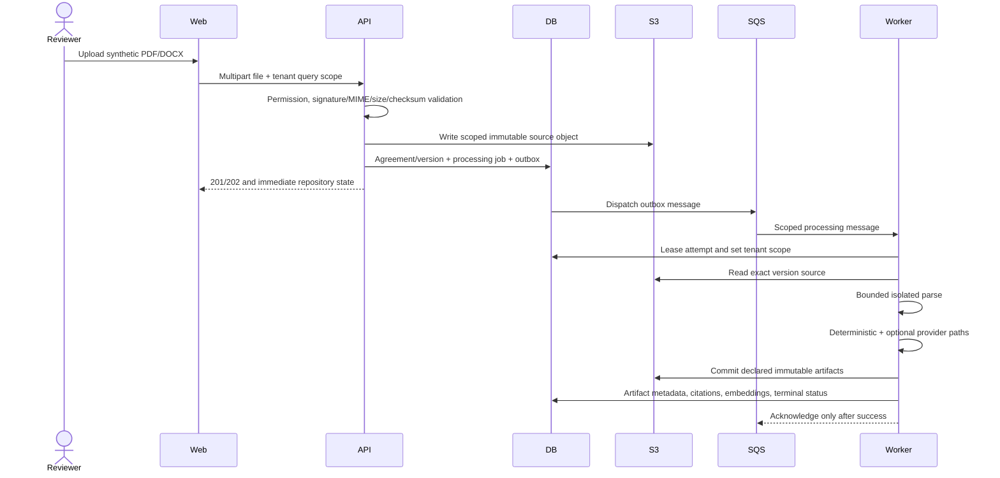
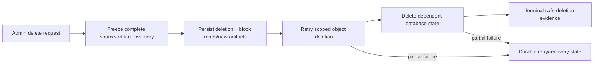
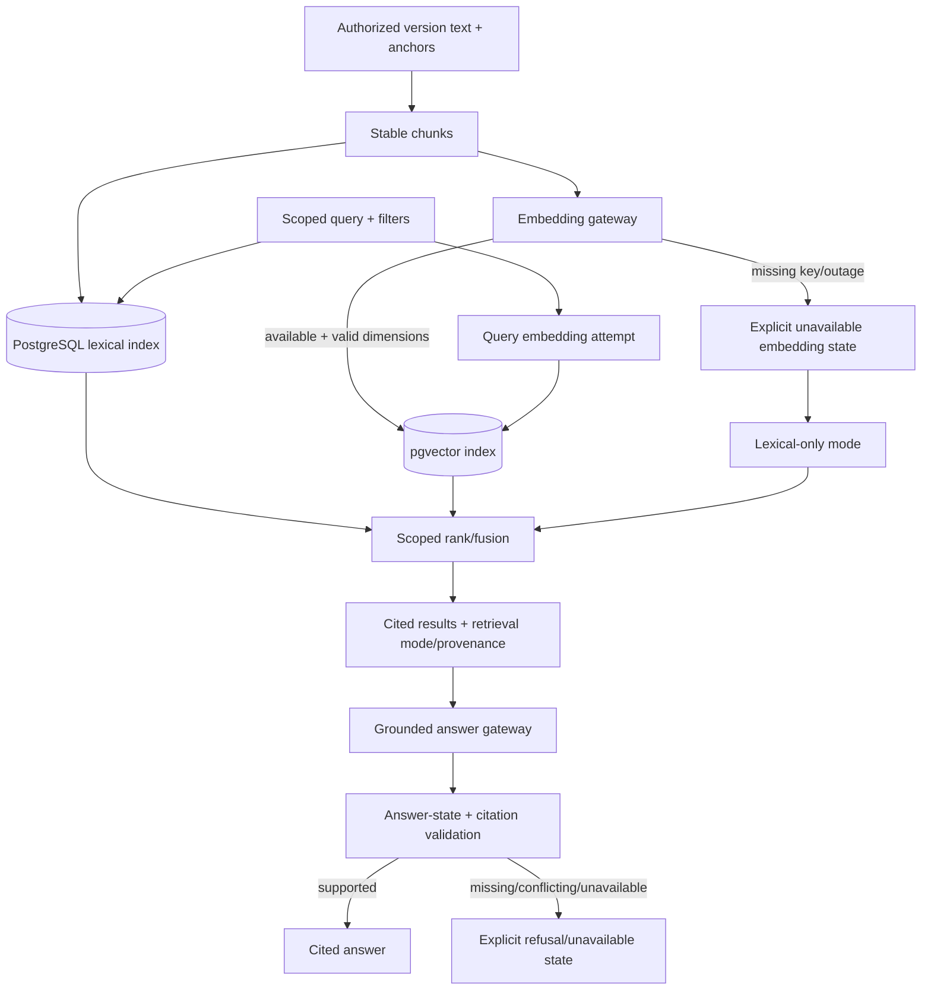
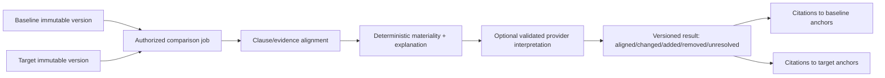
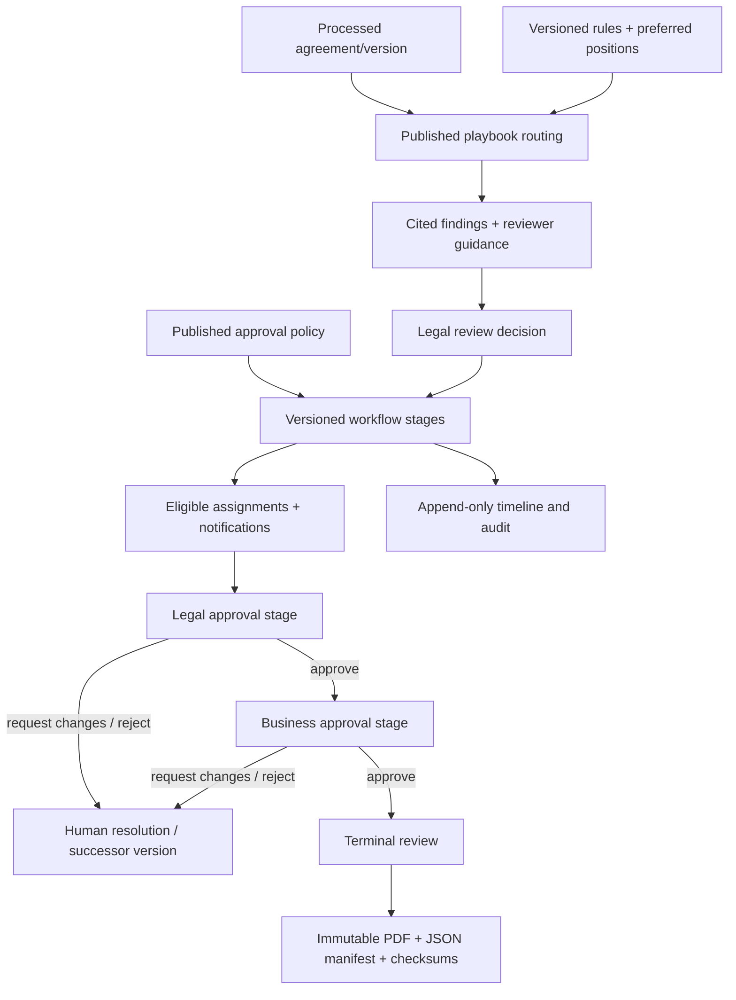
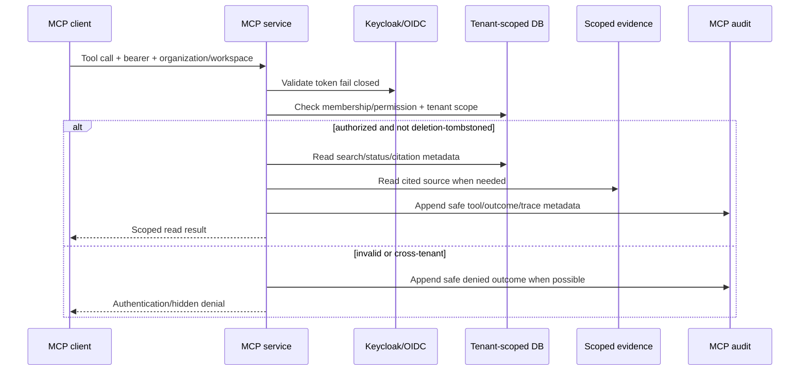
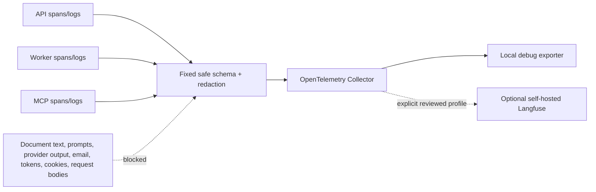
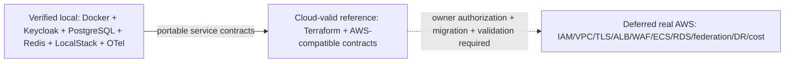

# Agreement Intelligence architecture

This document describes the merged local product, its cloud-valid reference design, and
the boundaries that remain unvalidated until an owner-authorized AWS deployment.

## Contents

- [Scope and principles](#scope-and-principles)
- [As-built local components](#as-built-local-components)
- [Authentication and authorization](#authentication-and-authorization)
- [Upload, processing, and deletion](#upload-processing-and-deletion)
- [Analysis, retrieval, and grounded Q&A](#analysis-retrieval-and-grounded-qa)
- [Versions and comparison](#versions-and-comparison)
- [Playbooks, review, and approval](#playbooks-review-and-approval)
- [MCP boundary](#mcp-boundary)
- [Telemetry and privacy](#telemetry-and-privacy)
- [Reliability and data ownership](#reliability-and-data-ownership)
- [Local, cloud-valid, and cloud-deferred views](#local-cloud-valid-and-cloud-deferred-views)
- [Quality and change governance](#quality-and-change-governance)

## Scope and principles

The initial measured domain covers Client Agreements and Liquidity Provider Agreements.
Delivered capabilities include repository ingestion, asynchronous processing, deterministic
and optional provider-assisted analysis, playbooks, hybrid retrieval, grounded questions,
immutable version comparison, multi-stage review/approval, audit/final packages, local
operations, and read-only MCP access.

The architecture follows these rules:

1. **Human-controlled legal decisions.** Model output is evidence assistance, not legal
   advice or approval.
2. **Tenant isolation at every layer.** Tokens authenticate; application membership,
   permission, scoped resource lookup, and forced PostgreSQL RLS authorize.
3. **Original evidence remains authoritative.** Derived claims carry source anchors,
   version/configuration provenance, and explicit uncertainty/failure state.
4. **Asynchronous expensive work.** Database intent plus outbox/SQS separates HTTP
   acknowledgement from parsing, analysis, embeddings, comparison, and recovery.
5. **Provider failure is visible.** Deterministic and lexical paths remain available where
   supported; provider output is never fabricated.
6. **One source of truth per concern.** PostgreSQL owns business state, S3 owns bytes, SQS
   wakes durable work, Redis coordinates ephemeral limits/locks/cache.
7. **Documents and providers are untrusted.** Parsing is bounded and isolated; prompt
   injection is evidence text; structured output/citations are validated.
8. **Safe observability.** Redaction and fixed safe attributes precede exporter handoff.
9. **Local proof is labeled.** Docker/LocalStack/Terraform evidence is not live-AWS proof.
10. **No hidden OCR claim.** Text-poor input can produce `ocr_required`; no OCR engine or
    provider is implemented.

[Back to contents](#contents)

## As-built local components

| Component | Responsibility | Must not become |
| --- | --- | --- |
| Next.js web | OIDC session, server-side API calls, role-aware product UI, download proxies | Authorization source of truth |
| FastAPI API | Domain commands/queries, permissions, tenant scope, workflow, OpenAPI | Long-running parser/model worker |
| Worker | Parse, analyze, index, compare, persist idempotent artifacts | User-facing authority or unscoped processor |
| MCP | Four audited read-only tools | Mutation/approval/upload interface |
| PostgreSQL/pgvector | Business state, versions, tenant RLS, audit, outbox, vectors | Raw object-byte store |
| LocalStack S3 | Immutable/scoped source and derived artifact bytes | Business metadata authority |
| LocalStack SQS | Processing/export/notification wake-up and redrive | State source or second database |
| Redis | Rate limits, budget reservations, locks, short cache | Durable queue or authoritative ledger |
| Keycloak | Local OIDC authentication/client/users | Application membership/permission database |
| OTel Collector | Safe operational telemetry transport | Prompt/document/provider-body store |

Default published ports bind to loopback. Bootstrap jobs create databases/pgvector,
LocalStack resources, Keycloak realm/client/users, and local demo memberships
idempotently.

[Back to contents](#contents)

## Authentication and authorization

Authentication uses OIDC state/PKCE, confidential-client token validation, issuer/client
claim matching, HTTP-only SameSite cookies, refresh, and controlled Keycloak logout. Any
missing identity configuration, unavailable validation endpoint, malformed claims, or
mismatch returns 401.

Application-owned roles include platform/organization/legal administrators, legal reviewer,
business user/approver, and auditor. Permissions cover workspace/member management,
agreement CRUD, review assignment/decision/approval, playbooks, approval policies, search,
and audit. The seeded legal reviewer also receives the business-user role so one identity
can upload/update and perform legal review in the local demo.

Every scoped API request uses query parameters `organization_id` and `workspace_id`
where the route requires them. Direct object IDs do not grant access. Unauthorized resource
lookups hide existence when disclosure would leak tenant state. UI navigation/capabilities
are convenience only.

[Back to contents](#contents)

## Upload, processing, and deletion

Upload accepts PDF/DOCX only after request/type/signature validation and duplicate checksum
checks. DOCX expansion, PDF complexity, parser memory/CPU/time, and child termination are
bounded. Text-poor output returns `ocr_required`; recognition is not performed.

Processing jobs carry explicit queued/processing/completed/failed states, reason categories,
attempts, leases, retry/requeue controls, and idempotent artifact ownership. Duplicate
delivery and worker restarts must not duplicate immutable artifacts.

Permanent agreement deletion is an authorized asynchronous workflow:

Deletion includes historical version keys and fences concurrent processing/artifact
commits. Archive/restore is a separate reversible lifecycle and must not be described as
permanent deletion.

[Back to contents](#contents)

## Analysis, retrieval, and grounded Q&A

Analysis combines deterministic domain logic with optional provider enrichment. Provider
output passes typed schema, semantic preservation, evidence-anchor, citation, and safety
validation before it can supplement deterministic artifacts. Invalid, timed-out, or
unavailable output records safe failure/provenance and leaves deterministic authority.

Lexical search matches normalized query terms against authorized indexed text. Semantic
retrieval requires compatible embeddings with versioned model, dimensions, configuration,
and index version. Filters and tenant scope apply before candidate fusion.

Each question turn performs fresh scoped retrieval. Conversation history is not a grant;
inaccessible old evidence is removed. Citations link to current accessible agreement/version
anchors. New search queries retry query embedding after provider recovery. Document
embeddings and enrichment that failed historically require manual reprocessing; automatic
backfill is deferred.

[Back to contents](#contents)

## Versions and comparison

Agreement versions are checksum-addressed, immutable lineage records. Uploading a successor
uses optimistic current-version checks and idempotency. The current agreement pointer does
not erase historical source ownership.

Comparison results identify exact baseline/target version IDs, configuration/profile
provenance, alignment state, materiality, uncertainty, and citations on both sides. An
unresolved alignment is a valid result, not an invitation to fabricate a match.

[Back to contents](#contents)

## Playbooks, review, and approval

Playbooks are versioned policy sources for agreement-family review. Drafts can be edited,
rules managed, and unused drafts deleted; publishing freezes the version; archive prevents
future routing without rewriting history. Eligible published playbooks route by explicit
family/scope, with overrides recorded.

Approval policy stages define eligible roles/users, all/any completion, escalation metadata,
due timing, and whether cross-stage same approver is permitted. The default safer design
separates legal and business decisions and denies unauthorized/self approval. Assignments,
comments, decisions, notifications, workflow revisions, and packages remain tenant scoped.

Terminal packages preserve a human-readable PDF and machine-readable JSON manifest with
checksums. Package creation/recovery is durable and terminal artifacts are immutable.

[Back to contents](#contents)

## MCP boundary

The only tools are `search_agreements`, `get_citation`,
`get_agreement_status`, and `get_review_status`. MCP does not upload, edit, delete,
approve, comment, or trigger processing. It reuses the API token-validation and
application-authorization semantics rather than trusting client-supplied claims.

[Back to contents](#contents)

## Telemetry and privacy

Allowed telemetry is operational: service/operation/outcome, safe reason categories, opaque
tenant-safe IDs, latency, retry counts, token/cost totals, retrieval/citation counts, queue
and workflow state. Raw agreement text, prompts, provider responses, credentials, personal
emails/subjects/titles, and request bodies are excluded before exporter handoff.

Retention variables are operator policy metadata. Immutable business audit records are not
automatically deleted, and optional Langfuse does not become the authority for prompts,
configuration, evaluation, or business audit.

[Back to contents](#contents)

## Reliability and data ownership

| Concern | Mechanism |
| --- | --- |
| HTTP replay | Idempotency keys/checksums and conflict responses |
| Database/message gap | Transactional outbox and replayable dispatcher |
| Duplicate delivery | Leases, processing identity, idempotent writes, completion fences |
| Partial artifact/deletion failure | Durable intent/inventory and recoverable terminal states |
| Lost update | Immutable versions plus optimistic current-version checks |
| Provider timeout/outage | Bounded retry, safe reason/provenance, deterministic/lexical fallback |
| Cross-tenant query | Application predicates, hidden lookup, transaction tenant GUC, forced RLS |
| Shared limits/cost | Redis distributed reservations/locks plus database settlement/source of truth |
| Local data loss | Checksum manifest backup/restore for PostgreSQL and LocalStack S3 |

The API persists business intent before returning. The worker acknowledges SQS only after
successful handling; exceptions preserve redelivery. Redis loss may reduce coordination but
must not erase authoritative state or become a missing durable job.

[Back to contents](#contents)

## Local, cloud-valid, and cloud-deferred views

| View | Demonstrated now | Not claimed |
| --- | --- | --- |
| As-built local | Complete Compose application; Keycloak; PostgreSQL/pgvector; Redis; LocalStack S3/SQS; OTel; browser/API/MCP/worker workflows | Internet exposure, high availability, managed service behavior |
| Cloud-valid reference | Terraform/provider/resource contracts, AWS-compatible APIs, encryption/lifecycle/redrive shape, migration runbook | Successful application deployment or production approval |
| Deferred live cloud | Intended ECS/RDS/S3/SQS/managed Redis/ALB/WAF/IAM/Secrets/observability/federation boundaries | Any validation until a real account/environment is authorized |

LocalStack cannot prove IAM evaluation, VPC/security-group paths, managed TLS, DNS, load
balancing, WAF, ECS/RDS behavior, federation, autoscaling, alarms, cost, or managed
backup/disaster recovery. See the [Terraform runbook](../../infra/terraform/README.md) and
[roadmap](../roadmap.md).

[Back to contents](#contents)

## Quality and change governance

The release evidence combines:

- formatting, lint, strict type checks, unit/integration/contract tests, and builds;
- disposable PostgreSQL forced-RLS verification;
- production JavaScript/Python dependency audits and full-history secret scanning;
- Terraform format/init/validate, Checkov, LocalStack plan/provisioning, and image checks;
- deterministic unified AI evaluation and opt-in assisted provider reports;
- Playwright critical journeys plus comprehensive manual browser/API/MCP/operations cases;
- backup/restore, performance, duplicate delivery, timeout, worker restart, queue backlog,
  and database interruption checks.

Architecture changes require an ADR when they alter system/deployment boundaries, a source
of truth, authentication/authorization, persistence/messaging guarantees, externally visible
API compatibility, security/privacy posture, or a major framework/service dependency.
ADRs remain append-only and superseded decisions link forward.

See [Manual QA](../testing/manual-test-plan.md), [Release evidence](../testing/release-evidence.md),
[Threat model](../security/threat-model.md), and [Contributing](../../CONTRIBUTING.md).

[Back to top](#agreement-intelligence-architecture)
