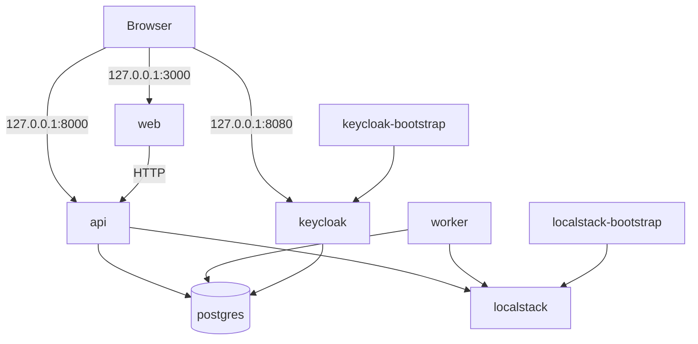

# Containerized Local Platform Design

**Status:** Approved for implementation planning
**Date:** 2026-07-28
**Parent story:** #3
**Design task:** #76

## 1. Goal

Provide one portable runtime path that starts the complete Agreement
Intelligence application and its local dependencies through Docker Compose.
A contributor cloning the repository should not need local Node.js or Python
runtimes to run the product demonstration.

The stack must:

- build and run the Next.js web application, FastAPI API, and Python worker;
- provide PostgreSQL with pgvector, S3 and SQS emulation, and OIDC identity;
- bootstrap required local resources deterministically;
- preserve development data across normal shutdown and restart;
- fail visibly when configuration, health checks, or bootstrap steps fail; and
- keep application images reusable for a later AWS ECS/Fargate deployment.

## 2. Decisions

### 2.1 One runtime path

Docker Compose is the only supported application runtime path. The existing
host-run `make dev`, `make dev-web`, `make dev-api`, and `make dev-worker`
commands will be removed.

Language-level commands remain available for contributors and CI:

- formatting;
- linting;
- type checking;
- unit tests; and
- application builds.

These commands verify source quality but do not represent a second application
runtime.

### 2.2 Compose project identity

The Compose file declares:

```yaml
name: agreement-intelligence
```

Docker therefore groups containers, networks, and volumes under the
`agreement-intelligence` project. Compose-generated container names remain
globally unique, while Docker Desktop presents service instances within the
project group.

Repository commands also pass `--project-name agreement-intelligence`, and
configuration validation rejects a conflicting `COMPOSE_PROJECT_NAME`. This
keeps status, shutdown, and reset scoped to the intended project even when a
developer has global Compose environment settings.

The design intentionally does not use `container_name`. Hard-coded container
names would prevent parallel stacks, interfere with scaling, and introduce
global Docker name collisions.

### 2.3 Cloud emulation

One LocalStack container provides both S3 and SQS. This keeps the local
protocols and client configuration aligned with the AWS reference deployment
without operating separate MinIO and ElasticMQ services.

### 2.4 Identity bootstrap

Keycloak realm structure is version-controlled. It defines the realm, OIDC web
client, redirect URIs, scopes, and non-secret configuration.

Credentials do not live in the realm export. A one-shot bootstrap service uses
Keycloak's administration CLI to idempotently:

- set the web client secret from local environment configuration;
- create or update seeded demonstration users; and
- set demonstration passwords from local environment configuration.

### 2.5 Persistent state

Normal shutdown preserves named volumes. Destructive reset requires an explicit
confirmation value and removes project volumes before recreating the stack.

PostgreSQL is the durable source for both application and Keycloak data.
LocalStack also receives a named volume, but its bootstrap remains idempotent so
the required resources can be recreated safely.

## 3. Scope

### 3.1 Included

- Production-style application Dockerfiles
- Docker Compose topology
- Pinned service and runtime images
- Safe environment template and validation
- PostgreSQL and pgvector initialization
- LocalStack S3 and SQS resource bootstrap
- Keycloak realm import and environment-driven user bootstrap
- Container health checks and dependency ordering
- Make-based stack lifecycle
- Automated stack verification
- Contributor documentation and business smoke test

### 3.2 Deferred

- Application database schema and migrations
- Document uploads to object storage
- Queue publishing, consumption, retries, or redrive tooling
- OIDC login and application session integration
- Authorization and tenant persistence
- Correlation identifiers and telemetry
- AWS infrastructure provisioning
- Container registry publication

The deferred capabilities belong to later stories and must not be simulated
with fake successful states.

## 4. Versioned image baseline

Images use exact version tags, never floating tags such as `latest`, `stable`,
or major-only aliases.

| Component | Image baseline |
| --- | --- |
| Web build and runtime | `node:22.23.1-bookworm-slim` |
| API and worker build and runtime | `python:3.13.14-slim-bookworm` |
| Python package manager | `ghcr.io/astral-sh/uv:0.11.32` |
| Database | `pgvector/pgvector:0.8.5-pg17-bookworm` |
| AWS emulator | `localstack/localstack:2026.07.0` |
| Identity provider | `quay.io/keycloak/keycloak:26.7.0` |

All selected images must support Linux AMD64 and Linux ARM64. Implementation
verification must build and run on the repository owner's Apple Silicon
workstation. CI story #4 will add Linux AMD64 validation.

Patch updates require a pull request with release-note review and complete stack
verification.

## 5. Service topology



### 5.1 Runtime services

| Service | Responsibility | Host port | Persistent state |
| --- | --- | --- | --- |
| `web` | Next.js application shell | `127.0.0.1:3000` | None |
| `api` | FastAPI application interface | `127.0.0.1:8000` | None |
| `worker` | Long-running Python worker | None | None |
| `postgres` | Application and Keycloak databases with pgvector | `127.0.0.1:5432` | `postgres-data` |
| `localstack` | S3 and SQS emulation | `127.0.0.1:4566` | `localstack-data` |
| `keycloak` | Local OIDC identity provider | `127.0.0.1:8080` | PostgreSQL |

### 5.2 One-shot bootstrap services

| Service | Responsibility | Successful terminal state |
| --- | --- | --- |
| `localstack-bootstrap` | Create and validate S3/SQS resources | Exit code `0` |
| `keycloak-bootstrap` | Configure secrets and seeded users | Exit code `0` |

Bootstrap services use the same pinned LocalStack and Keycloak images as their
runtime services so that extra administrative image dependencies are avoided.

### 5.3 Network

All services join one Compose-managed default network. Internal communication
uses Compose service DNS names:

- `web`
- `api`
- `worker`
- `postgres`
- `localstack`
- `keycloak`

No application depends on Compose-generated container names or container IP
addresses.

Only developer-facing endpoints bind to the loopback interface. The worker and
bootstrap services expose no host ports.

## 6. Application images

### 6.1 Web

The web Dockerfile uses multiple stages:

1. install the pinned pnpm release through Corepack;
2. install locked workspace dependencies;
3. build Next.js in standalone output mode; and
4. copy only the standalone server, static assets, and required public assets
   into the runtime stage.

The runtime uses the image's unprivileged `node` user. The container starts the
standalone server and listens on `0.0.0.0:3000`.

`API_BASE_URL` uses the internal Compose URL `http://api:8000`.

### 6.2 API

The API Dockerfile:

1. copies uv `0.11.32` from its pinned official image;
2. creates the locked environment in a build stage;
3. builds or installs only the API package and production dependencies; and
4. copies the ready environment into a minimal runtime stage.

The runtime creates and uses an unprivileged application user. Uvicorn listens
on `0.0.0.0:8000` without development reload.

### 6.3 Worker

The worker uses a separate Dockerfile and runtime image even when build stages
share the same Python base pattern. Its installed package and entry point are
independent from the API, preserving separately deployable and scalable
services.

The worker runs as an unprivileged user and receives SIGTERM directly as the
container's primary process.

### 6.4 Build context

A root `.dockerignore` excludes:

- Git metadata;
- local virtual environments;
- JavaScript dependency directories;
- framework and test caches;
- generated distributions;
- local environment files;
- editor metadata; and
- documentation not required by a runtime build.

No local secret or credential may enter a build context or image layer.

## 7. Data and resource bootstrap

### 7.1 PostgreSQL

The PostgreSQL entrypoint initialization creates isolated databases and roles:

- application database and application role;
- Keycloak database and Keycloak role.

The application database receives:

```sql
CREATE EXTENSION IF NOT EXISTS vector;
```

Initialization scripts are safe for first-volume creation. Ongoing application
schema changes will later use a migration framework and must not be added to
entrypoint initialization.

### 7.2 LocalStack

The bootstrap service waits for LocalStack health and then idempotently creates:

- private bucket `agreement-intelligence-documents`;
- queue `agreement-intelligence-agreement-processing`;
- queue `agreement-intelligence-agreement-processing-dlq`;
- queue `agreement-intelligence-exports`;
- queue `agreement-intelligence-exports-dlq`;
- queue `agreement-intelligence-notifications`; and
- queue `agreement-intelligence-notifications-dlq`.

Each primary queue receives a redrive policy targeting its corresponding dead
letter queue. Queue and bucket creation treats an existing resource as success,
then validates the final configuration.

Local development uses a fixed non-sensitive AWS region and placeholder AWS
credentials required by AWS SDK conventions.

### 7.3 Keycloak

The version-controlled realm is named `agreement-intelligence`. It defines:

- an enabled local realm;
- a confidential web client named `agreement-intelligence-web`;
- authorization-code flow enabled;
- direct access grants and implicit flow disabled;
- local redirect and post-logout URIs;
- standard `openid`, `profile`, and `email` scopes; and
- self-registration disabled.

Keycloak runs locally with `start-dev --import-realm`, explicit PostgreSQL
configuration, and health support enabled. Development mode is acceptable for
this loopback-only dependency and is not the production identity deployment
model. The AWS reference environment continues to use managed OIDC identity.

The realm export does not contain:

- client secrets;
- user passwords;
- bootstrap administrator credentials; or
- environment-specific signing keys.

The Keycloak bootstrap service authenticates with local bootstrap administrator
credentials from `.env`. It sets the confidential client secret and creates or
updates demonstration users. Re-running bootstrap converges the configured
users and passwords rather than failing on existing users.

Application roles and tenant membership remain application data and are not
granted from Keycloak claims.

## 8. Startup and shutdown

Compose dependency conditions enforce readiness:

1. `postgres` completes first-volume initialization, starts accepting
   connections, and becomes healthy.
2. `localstack` starts and becomes healthy.
3. PostgreSQL first-volume initialization creates databases and pgvector.
4. `localstack-bootstrap` runs after LocalStack is healthy and exits `0`.
5. `keycloak` starts after PostgreSQL is healthy, imports the realm, and becomes
   healthy.
6. `keycloak-bootstrap` runs after Keycloak is healthy and exits `0`.
7. `api` and `worker` start after required bootstrap services complete
   successfully.
8. `web` starts after the API is healthy.

Compose health conditions use `service_healthy`; one-shot dependencies use
`service_completed_successfully`.

Normal shutdown stops services in reverse dependency order and preserves named
volumes. Application containers must terminate within a bounded grace period.

## 9. Configuration contract

The root `.env.example` contains names, safe placeholders, and descriptions for
all required settings. The real root `.env` is ignored.

Configuration groups include:

- application database names, users, and passwords;
- Keycloak database credentials;
- Keycloak bootstrap administrator credentials;
- OIDC client identifier and secret;
- seeded user identities and passwords;
- LocalStack region and local AWS placeholder credentials;
- S3 bucket name; and
- SQS queue names.

Compose uses required-value interpolation for mandatory settings. A validation
script rejects:

- missing `.env`;
- empty required values;
- unchanged secret placeholders; and
- invalid or conflicting local port values; and
- database credentials that cannot be safely represented in the internal
  PostgreSQL/JDBC connection URLs.

`make stack-up` runs validation before invoking Compose.

PostgreSQL role passwords and Keycloak bootstrap administrator credentials are
initial-volume settings. Changing them requires
`make stack-reset CONFIRM=reset`; normal startup must not imply that these
credentials converge against an existing volume. The OIDC client secret and
seeded demo-user credentials do converge through the idempotent Keycloak
bootstrap.

The local `.env` is not presented as a production secret-management mechanism.
AWS deployments will source runtime secrets from Secrets Manager or another
approved secret store.

## 10. Security controls

- Web, API, and worker run as non-root users.
- Application services drop unnecessary Linux capabilities.
- Application services set `no-new-privileges`.
- Runtime images contain no compilers or package-manager caches.
- Local ports bind only to `127.0.0.1`.
- LocalStack is not given the Docker socket because S3 and SQS do not require
  it.
- Credentials are absent from Git history, Docker build arguments, and image
  layers.
- Health and bootstrap output must not print passwords, client secrets, or
  access tokens.
- Keycloak self-registration is disabled.
- Object storage is private.
- SQS messages and bootstrap resources contain no document content.

Platform images run with the permissions required by their official images.
Application hardening must not be copied blindly to stateful platform
containers when it would break supported operation.

## 11. Make command surface

The runtime commands are:

| Command | Purpose |
| --- | --- |
| `make stack-build` | Build the web, API, and worker images. |
| `make stack-up` | Validate configuration, build, start, and wait for the complete stack. |
| `make stack-down` | Stop and remove containers while preserving volumes. |
| `make stack-status` | Show project services and health state. |
| `make stack-logs` | Follow logs for the complete project. |
| `make stack-check` | Verify containers, endpoints, and bootstrapped resources. |
| `make stack-reset CONFIRM=reset` | Remove project containers and volumes, then recreate the stack. |

`stack-reset` exits without changing state unless `CONFIRM=reset` is supplied.
After confirmation, it validates `.env` and the rendered Compose model before
deleting any volume.

The existing `make setup`, formatting, linting, type-checking, testing, build,
and `make check` commands remain source-quality commands. Host application
startup targets are removed.

## 12. Failure handling

- Missing prerequisites fail before container creation.
- Invalid environment configuration fails before container creation.
- Image build failure stops startup.
- A dependency health timeout leaves the failing service visible for
  inspection and returns a non-zero command status.
- A bootstrap failure returns non-zero and prevents dependent application
  services from starting.
- Bootstrap scripts distinguish already-existing resources from genuine
  failures.
- `stack-check` returns non-zero on the first failed contract and identifies
  the affected service or resource without printing secrets.
- Reset requires explicit confirmation and affects only resources in the
  `agreement-intelligence` Compose project.

Troubleshooting documentation directs contributors to `make stack-status` and
`make stack-logs`.

## 13. Verification strategy

### 13.1 Static verification

- Validate the fully interpolated Compose configuration.
- Lint Dockerfiles with the security workflow introduced in story #4.
- Confirm prohibited files are excluded from build contexts.
- Confirm no floating image tags are present.
- Confirm no secrets are committed.

### 13.2 Image verification

- Build web, API, and worker images without local dependency directories.
- Inspect application runtime users and fail if UID `0` is used.
- Verify runtime commands and health checks.
- Verify graceful worker termination.

### 13.3 Platform contract verification

`make stack-check` verifies:

- every required service exists in the `agreement-intelligence` project;
- runtime services are running and healthy;
- one-shot bootstrap services exited successfully;
- PostgreSQL accepts the application and Keycloak credentials;
- the application database exposes the `vector` extension;
- the private S3 bucket exists;
- all six queues exist;
- each primary queue has the correct dead-letter redrive policy;
- the Keycloak realm, OIDC client, and seeded users exist;
- the web client secret matches local configuration without printing it;
- the API liveness contract is correct;
- Swagger UI is available;
- the web shell reports API connectivity; and
- the worker emits its structured startup event.

### 13.4 Lifecycle verification

The implementation must demonstrate:

1. fresh startup from a clean volume state;
2. successful complete stack verification;
3. normal shutdown with no remaining project containers;
4. restart with persisted database and identity state;
5. idempotent resource bootstrap after restart;
6. rejected reset without explicit confirmation; and
7. successful confirmed reset followed by clean recreation.

## 14. Planned file map

```text
.
├── .dockerignore
├── .env.example
├── compose.yaml
├── Makefile
├── README.md
├── apps/
│   ├── api/Dockerfile
│   ├── web/Dockerfile
│   └── worker/Dockerfile
├── docker/
│   ├── keycloak/
│   │   ├── bootstrap.sh
│   │   └── realm/agreement-intelligence-realm.json
│   ├── localstack/bootstrap.sh
│   └── postgres/init-databases.sh
└── scripts/
    ├── stack-check.sh
    └── validate-stack-env.sh
```

The implementation plan may split scripts into focused helpers when required,
but it must preserve the responsibilities and boundaries in this design.

## 15. Business demonstration

A reviewer with Docker Compose and GNU Make will:

1. clone the repository;
2. copy `.env.example` to `.env` and replace the marked local secrets;
3. run `make stack-up`;
4. open the web application and observe API connectivity;
5. open Swagger UI;
6. inspect the grouped `agreement-intelligence` project in Docker Desktop;
7. run `make stack-check`;
8. run `make stack-down`; and
9. confirm that no project containers remain.

The demonstration proves portable application execution, cloud-shaped local
dependencies, deterministic identity and resource bootstrap, persistence, and
safe lifecycle management. It does not claim that deferred business workflows
already exist.

## 16. Implementation constraints

- Every implementation change must link to a GitHub task under story #3.
- Work occurs on dedicated branches and reaches `main` only through reviewed
  pull requests.
- Only the repository owner merges.
- No delivery metadata may contain assistant or model-provider branding.
- Existing source-quality checks must remain green.
- New container verification must be suitable for later GitHub Actions use.
- No AWS account or paid LocalStack feature may be required.

## 17. References

- [Docker Compose startup order](https://docs.docker.com/compose/how-tos/startup-order/)
- [Node official image](https://hub.docker.com/_/node)
- [Python official image](https://hub.docker.com/_/python)
- [Using uv in Docker](https://docs.astral.sh/uv/guides/integration/docker/)
- [pgvector Docker image](https://hub.docker.com/r/pgvector/pgvector)
- [LocalStack Docker image](https://hub.docker.com/r/localstack/localstack)
- [Keycloak container guide](https://www.keycloak.org/server/containers)
- [Keycloak realm import and export](https://www.keycloak.org/server/importExport)
