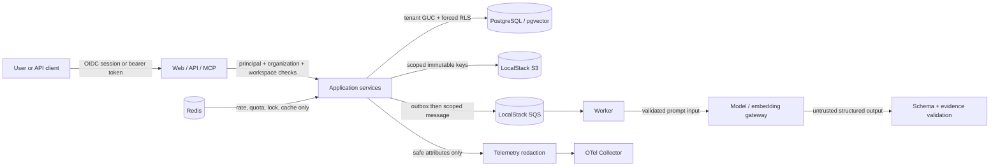

# Threat model

This document describes the merged local system and its cloud-valid reference boundary.
It is not a penetration-test report or evidence of a live AWS deployment.

## Contents

- [Scope and assumptions](#scope-and-assumptions)
- [Assets](#assets)
- [Actors and entry points](#actors-and-entry-points)
- [Trust boundaries](#trust-boundaries)
- [Threats and controls](#threats-and-controls)
- [Security invariants](#security-invariants)
- [Residual and deferred risks](#residual-and-deferred-risks)
- [Verification](#verification)

## Scope and assumptions

The assessed local topology is the default Docker Compose project: browser, Next.js web
application, FastAPI API, processing worker, read-only MCP service, Keycloak, PostgreSQL
with pgvector, Redis, LocalStack S3/SQS, and the OpenTelemetry Collector. Published ports
bind to loopback. The operator controls the host, `.env`, provider account, and any input
documents.

The cloud-valid Terraform and architecture documents describe intended AWS mappings.
LocalStack checks resource wiring and compatible API behavior but cannot prove IAM,
networking, managed TLS, WAF, RDS/ECS operations, federation, scaling, or managed disaster
recovery.

Assumptions:

- the host and Docker daemon are trusted administrative boundaries;
- `.env` is ignored, readable only by the operator, and contains no shared production
  secret;
- tests and screenshots use synthetic or legally reusable agreements;
- users may upload hostile documents and document text is untrusted;
- model-provider output is untrusted until schema, evidence, and citation validation pass;
- authenticated tenants may attempt to access other tenants or exhaust shared capacity;
- MCP clients and API clients may be malformed or malicious; and
- human reviewers remain accountable for legal decisions.

[Back to contents](#contents)

## Assets

| Asset | Security objective |
| --- | --- |
| Source PDF/DOCX and derived text | Confidentiality, integrity, scoped deletion, bounded parsing |
| Agreement metadata and immutable versions | Tenant isolation, integrity, lineage, availability |
| Citations, findings, comparisons, answers | Evidence integrity, provenance, reproducibility |
| Playbooks and approval policies | Authorized versioning and publication |
| Review decisions, comments, audit ledger, final packages | Attribution, immutability, confidentiality |
| OIDC sessions, bearer tokens, provider keys, database credentials | Confidentiality, rotation, no logging |
| Embeddings and retrieval indexes | Same tenant and retention boundary as source content |
| Queues, outbox records, deletion/artifact intents | Idempotency, correct ownership, recovery |
| Logs, traces, metrics, screenshots, backups | Data minimization, retention, controlled access |
| Infrastructure definitions and build inputs | Provenance, repeatability, least privilege |

[Back to contents](#contents)

## Actors and entry points

| Actor | Access and relevant risk |
| --- | --- |
| Platform administrator | Broad local-demo capabilities; account compromise has high impact |
| Legal reviewer / business user | Reads, uploads, updates, searches, and records legal decisions |
| Business approver | Reads, searches, and acts on assigned approval stages |
| Auditor or other configured role | Read-only permissions defined by application membership |
| Unauthenticated user | Sign-in surface, public health endpoint, OIDC redirects |
| Authenticated hostile tenant | Cross-tenant enumeration, unsafe upload, quota abuse, prompt injection |
| API or Insomnia client | Malformed scope headers, replay, token leakage, over-broad requests |
| MCP client | Tool-input abuse, cross-scope queries, output leakage |
| Model/embedding provider | Availability, cost, retention, malformed output, external data processing |
| Dependency/build publisher | Supply-chain compromise or mutable build inputs |
| Local operator | Host, Docker, environment, backup, and destructive-reset authority |

Primary entry points are the web application, FastAPI routes, OIDC callbacks, document
upload, MCP endpoint, provider gateway, S3/SQS-compatible endpoints, and operator commands.

[Back to contents](#contents)

## Trust boundaries

- **Identity boundary:** Keycloak authenticates; the application owns organization,
  workspace, role, permission, and resource checks. A valid token alone is insufficient.
- **Tenant boundary:** application predicates, hidden-resource responses, organization
  scope, workspace scope, and forced PostgreSQL RLS provide layered isolation.
- **Document boundary:** uploaded bytes and extracted text are hostile. Validation,
  size/type checks, parser isolation, time/resource limits, and safe failure states precede
  durable derived output.
- **Model boundary:** documents are evidence, never instructions. Prompt composition,
  typed outputs, deterministic authority, citations, and refusal states constrain provider
  output.
- **Storage boundary:** database rows, object keys, versions, artifacts, backups, and
  deletion intents share organization/workspace ownership.
- **Telemetry boundary:** redaction and a fixed attribute allowlist apply before exporter
  handoff. Raw content and credentials are excluded.
- **MCP boundary:** the four exposed tools are read-only and reuse OIDC, authorization,
  tenant scope, audit, and trace controls.

[Back to contents](#contents)

## Threats and controls

### Authentication, session, and authorization

Threats include token forgery, stale sessions, open redirect, missing workspace scope,
role confusion, ID enumeration, and cross-tenant access. NextAuth uses OIDC state and
PKCE, HTTP-only SameSite cookies, controlled Keycloak logout, token refresh, and
fail-closed API validation. API resources require explicit permissions plus organization
and workspace membership. Unauthorized resources use not-found behavior where revealing
existence would leak tenant information. Tenant tables with `organization_id` use forced
RLS and the application scopes the database session.

Test both positive and negative paths. Never treat UI navigation hiding as authorization.

### Untrusted documents and parser exhaustion

PDF and DOCX files may contain malformed structures, decompression bombs, excessive
objects/pages, embedded references, or content designed to consume CPU/memory. Upload
validation checks signature, MIME/extension agreement, request size, and duplicate
checksum. Parsing runs in an isolated child with hard time/resource bounds and guarded
DOCX expansion. A controlled parse failure is preferable to partial unbounded output.

Image-only or text-poor input can produce `ocr_required`. The repository includes the
diagnostic but no OCR engine; operators must not describe this as OCR processing.

### Prompt injection and model output

Agreement text can instruct a model to ignore rules, disclose other data, fabricate a
clause, or invoke external actions. The system labels document text as untrusted evidence,
retrieves only authorized chunks, excludes inaccessible historical evidence, requires
typed output, validates evidence anchors/citations against the current source, and rejects
unsupported claims. Deterministic output remains authoritative when provider-assisted
output fails validation.

No model result is legal advice or an autonomous approval. Reviewers must follow the
source citations and the original document.

### Retrieval and embedding leakage

Embeddings can encode sensitive text. Chunks and vectors remain organization/workspace
scoped and are queried in the same tenant transaction. Lexical and vector candidates are
filtered before fusion. Conversation turns perform fresh scoped retrieval; previous
citations do not grant access. Semantic retrieval is unavailable when embeddings cannot
be produced, while lexical retrieval remains explicit.

### Storage, deletion, and immutable history

Object keys are organization/workspace scoped, artifact writes are immutable or
idempotent, and agreement versions preserve checksums and lineage. Permanent deletion is
asynchronous and tracks the complete object inventory, durable deletion state, artifact
ownership fences, retries, and terminal audit evidence. The UI's delete action is
destructive and restricted to authorized administrators.

Final review packages have PDF and JSON manifest artifacts with checksums. Immutable
business audit events and review history are not the place for credentials or unrestricted
personal data; free-form values pass sensitive-value redaction.

### Queue, replay, and recovery

The database outbox separates state changes from SQS publication. Messages carry scoped
IDs, processing uses leases and idempotent artifact writes, and acknowledgment follows
successful handling. Duplicate delivery, worker restart, provider timeout, queue backlog,
and database interruption have focused recovery checks. Failed work remains visible and
can be retried or requeued through authorized paths.

Automatic historical provider-enrichment reconciliation is not guaranteed; manual
reprocessing is current behavior and automatic backfill remains deferred.

### Quotas, cost, and shared availability

Redis holds distributed rate limits, tenant budget reservations, short-lived caches, and
locks; it is not a source of truth or a second queue. Expensive operations fail closed when
configured token/cost budgets cannot be reserved. Local thresholds demonstrate behavior,
not internet-scale denial-of-service protection.

### Secrets, privacy, logs, and telemetry

Credentials remain in ignored local configuration and are never valid example values.
Logs and traces use opaque identifiers, safe reason codes, timings, counts, token/cost
totals, and workflow state. They exclude document text, prompts, provider output, email,
subject values, tokens, cookies, keys, request bodies, and raw identifiers before export.
Retention values describe operator policy metadata; the local demo does not implement a
complete production retention program.

Backups contain sensitive application data and must inherit the source environment's
access, retention, and destruction controls.

### MCP

`search_agreements`, `get_citation`, `get_agreement_status`, and `get_review_status` are
read-only. The server validates OIDC tokens fail closed, requires the same organization,
workspace, and permission scope as the API, hides unauthorized resources, blocks deletion
tombstones, records an immutable MCP audit event, and propagates safe trace context. It
does not expose mutation, approval, upload, or deletion tools.

### Supply chain and infrastructure

Locked application dependencies, pinned CI action commits, pinned service image digests,
production dependency audits, Terraform validation/policy checks, container scanning, and
full-history secret scanning reduce build risk. They do not eliminate compromise risk.
Real AWS least privilege, network paths, TLS, WAF, managed secrets, image signing, and
runtime monitoring require an authorized deployment and separate evidence.

[Back to contents](#contents)

## Security invariants

1. A bearer token never substitutes for application-owned membership and permission.
2. A tenant query never runs without organization scope and workspace checks where
   applicable.
3. Source text, vectors, citations, packages, audit, and deletion records retain the same
   tenant ownership.
4. Document text and provider output are untrusted; citations must resolve to accessible
   current evidence.
5. Provider failure never produces a fabricated provider success.
6. MCP cannot mutate platform data.
7. Secrets and raw agreement content never enter committed fixtures, telemetry, or release
   evidence.
8. Ordinary shutdown and troubleshooting preserve volumes; destructive actions require
   explicit confirmation.
9. LocalStack success is never represented as live-AWS proof.
10. A human, not a model, owns review and approval decisions.

[Back to contents](#contents)

## Residual and deferred risks

- The repository is a locally production-oriented demonstration, not a supported hosted
  service.
- The owner must complete the manual release pass and visibility decision.
- Provider privacy, regional processing, quality, latency, quota, and cost depend on the
  operator's provider agreement and configuration.
- No OCR provider is included; scanned/image-only documents can stop at `ocr_required`.
- Automatic historical AI-enrichment backfill after an outage is deferred.
- Real AWS IAM, networking, TLS, WAF, ECS/RDS, federation, scaling, monitoring, backup,
  disaster recovery, cost, and load behavior remain unvalidated.
- Local Docker timing and quotas are evidence for regression detection, not cloud SLOs.
- Legal interpretation and materiality remain uncertain and require qualified human
  review.

See [responsible AI](responsible-ai.md), the
[pre-publication review](../reviews/2026-08-22-pre-publication-review.md), and the
[roadmap](../roadmap.md).

[Back to contents](#contents)

## Verification

Use the narrowest safe check while developing, then run the public-release gate described
in [release evidence](../testing/release-evidence.md). Security-relevant checks include
source tests, disposable-database RLS coverage, hostile document cases, dependency audits,
Terraform/LocalStack verification, full-history secret scanning, manual negative cases,
and cross-tenant browser/API/MCP checks.

Record commands, commit, timestamp, result, safe counts, and artifact checksums. Do not
copy detected values, tokens, provider bodies, prompts, or document text into evidence.

[Back to top](#threat-model)
